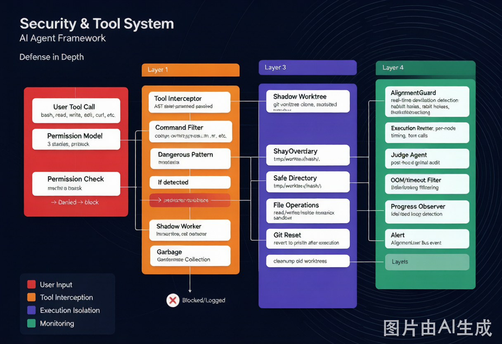
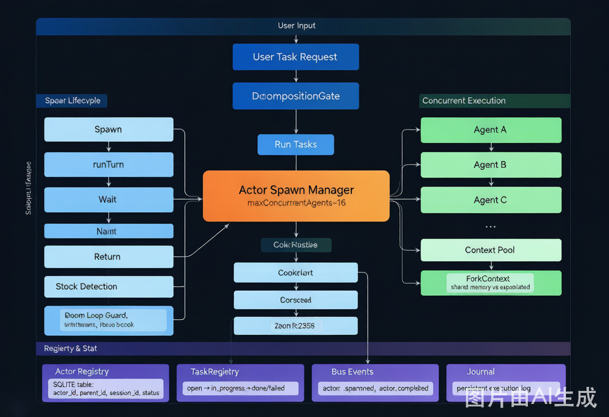
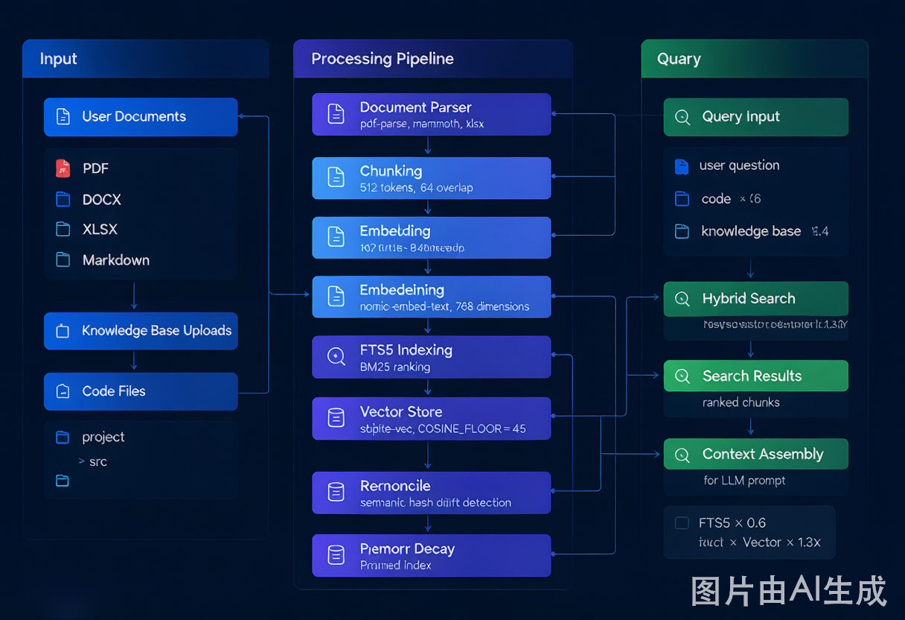

# Helix 智能体基础架构全景文档（修订版 v2.0）

> 版本：v2.0 | 基于 Helix 项目代码逐文件审查（branch: helix-auto-dev, commit f6f18c6）
> 本文档通过实际源码验证，每个模块的描述均与代码实现对应。如有架构更新，需同步更新本文档。

---

## 目录

> **推荐阅读顺序（按智能体 Pipeline）**：1 → 2 → 3 → **4** → **5** → **6** → **7** → **8** → **9** → **10** → **11** → **12** → 13 → 14 → 15 → 16 → 17 → 18 → 19 → 20 → 21

1. [架构总览](#1-架构总览)
2. [审查报告与修正说明](#2-审查报告与修正说明)
3. [输入处理与意图解析](#3-输入处理与意图解析)
4. [配置系统](#4-配置系统)
5. [上下文管理与组装](#5-上下文管理与组装)
6. [LLM 交互层](#6-llm-交互层)
7. [智能体规划与工作流](#7-智能体规划与工作流)
8. [工具系统](#8-工具系统)
9. [安全隔离层](#9-安全隔离层)
10. [调度与执行](#10-调度与执行)
11. [状态管理](#11-状态管理)
12. [智能体记忆系统](#12-智能体记忆系统)
13. [评估与裁判系统](#13-评估与裁判系统)
14. [可观测性](#14-可观测性)
15. [通信协议](#15-通信协议)
16. [执行环境](#16-执行环境)
17. [错误处理与恢复](#17-错误处理与恢复)
18. [事件总线](#18-事件总线)
19. [全链路数据流](#19-全链路数据流)
20. [设计原则与取舍](#20-设计原则与取舍)
21. [附录：文件路径索引](#21-附录文件路径索引)

---

## 1. 架构总览

Helix 的智能体架构采用**分层设计**，从下到上依次为：

```
┌─────────────────────────────────────────────────────────────────┐
│  L3 Access Layer   │  HTTP API + SSE / MCP Server / SDK / TUI  │
├─────────────────────────────────────────────────────────────────┤
│  L2 Control Layer  │  Hybrid FSM / Judge Agent / AlignmentGuard │
│                    │  AskQuestion / ProgressObserver / TaskGate │
├─────────────────────────────────────────────────────────────────┤
│  L1 Memory Layer   │  SQLite FTS5 BM25 + Vector RAG (sqlite-vec)│
│                    │  Memory Reconcile / Multi-LLM Embedding    │
├─────────────────────────────────────────────────────────────────┤
│  L0 Security Layer │  Shadow Worktree / ToolInterceptor (AST)   │
│                    │  VFSOverlay / Permission System            │
└─────────────────────────────────────────────────────────────────┘
```

智能体由 **18 个基础维度** 协同构成。以下逐一展开，每个维度均标注对应的源码文件和关键数据结构。

---

## 2. 审查报告与修正说明

> 以下列出 v1.0 文档中的错误及修正，便于读者理解本次修订的动机。

| # | v1.0 错误描述 | 修正后 | 代码依据 |
|---|--------------|--------|----------|
| 1 | `classify.ts` "将用户输入分类为 chat/build/plan/compose/max 模式" | `classify.ts` 是对 **Assistant Step 输出** 的分类（`final`/`continue`/`filtered`/`think-only`/`invalid`/`failed`） | `classify.ts:31-91` |
| 2 | `session/mode.ts` 存在 | 文件不存在，已删除 | 文件搜索 |
| 3 | `memory/decay.ts` 存在 | 文件**实际存在**（`memory/memory-decay.ts`），实现基于 Semantic Hash 的记忆衰减机制 | `memory/memory-decay.ts:1-147` |
| 4 | `knowledge_graph/` 存在 | 目录不存在，已删除 | 文件搜索 |
| 5 | `config/error.ts` 是"标准化错误体系" | 只包含 `ConfigJsonError`/`ConfigInvalidError`，通用 `NamedError` 在 `@mimo-ai/shared/util/error` | `config/error.ts:1-22` |
| 6 | `tool/screenshot.ts` 是"安全相关的 GUI 状态验证" | 是**视觉分析工具**（UI调试、PPT纠错、终端报错截图分析） | `tool/screenshot.ts:1-52` |
| 7 | `control-plane/workspace-context.ts` 是"项目信息、依赖关系、文件结构" | 实际只是 `workspaceID` 的 `LocalContext` 管理器 | `control-plane/workspace-context.ts:1-27` |
| 8 | `effect/instance.ts` 存在 | 文件不存在，实际为 `effect/instance-state.ts` | 文件搜索 |
| 9 | `memory/reconcile.ts` 是"合并重复/相似记忆" | 实际是从磁盘扫描 `.md` 文件，同步到 FTS 索引，删除（prune）已不存在的文件 | `memory/reconcile.ts:46-146` |
| 10 | RAG 混合排序只说"加权融合" | 具体公式：`BM25 × 0.6 + Vector × 0.4`，共存项 boost 1.3x | `memory/service.ts:199-211` |
| 11 | Bash 默认超时 "30s" | 实际为 `2 * 60 * 1000 = 120000ms`（2 分钟） | `tool/bash.ts:29` |
| 12 | `task/gate.ts` 是"目标分解器" | 实际为 **Stop-Gate ReAct**，检查未完成任务并决定是否重新进入循环 | `task/gate.ts:71-114` |
| 13 | `goal.ts` evaluate 返回 `success/failed/needs_revision` | 实际返回 `Verdict`（`ok: boolean`, `impossible?: boolean`, `reason: string`） | `session/goal.ts:33-38` |
| 14 | `goal.ts` 有"修订任务目标"功能 | 实际只有 `set`/`get`/`clear`/`bumpReact`/`evaluate`，没有 revision | `session/goal.ts:81-98` |
| 15 | 三层成功定义（L0/L1/L2）在 `task/gate.ts` | 代码中未找到对应实现，属设计概念 | 文件搜索 |
| 16 | Cardinal 四级阻塞（Block/Pause/Stop/Warn）在 `alignment-guard.ts` | 代码中 AlignmentGuard 只有 `warn`/`critical` 两级告警 | `observability/alignment-guard.ts:41-55` |
| 17 | `max-mode.ts` 是"构建超长上下文" | 实际为 **多候选者并行生成**（parallel candidates + judge selection），默认 5 个候选 | `session/max-mode.ts:15-70` |
| 18 | Event Bus API 是 `subscribe(eventType, callback)` | 实际 API 为 `subscribeCallback(def, callback)` | `bus/index.ts:154-166` |

---

## 3. 输入处理与意图解析

### 职责
接收用户原始输入，完成消息标准化、意图解析、Agent 选择，决定后续进入哪条处理管线。

### 核心组成

| 组件 | 文件 | 作用 | 关键数据结构 |
|------|------|------|-------------|
| **Assistant Step 分类器** | `session/classify.ts` | 对 Assistant 单步输出分类，决定 loop 是否继续 | `StepClassification = { type: "final" \| "continue" \| "filtered" \| "think-only" \| "invalid" \| "failed" }` |
| **会话处理器** | `session/processor.ts` | 核心消息处理 loop，驱动 LLM 调用、工具执行、状态流转 | `Handle: { message, updateToolCall, completeToolCall }` |
| **消息标准化** | `session/message-v2.ts` | 统一消息结构，支持 `text`/`image`/`file`/`tool` 多模态 | `MessageV2.User` / `MessageV2.Assistant` / `MessageV2.Part` |
| **Agent 配置** | `config/agent.ts` | 定义不同 Agent 的模式（`subagent`/`primary`/`all`）、工具白名单、权限 | `AgentSchema: { mode, permission, tool_allowlist, steps }` |
| **Agent 注册表** | `agent/agent.ts` | 管理所有 Agent 的元数据，支持动态生成新 Agent | `Agent.Info: { name, mode, permission, model?, toolAllowlist? }` |

### 关键细节

**3.1 classifyAssistantStep 的分类逻辑**

`classify.ts:31-91` 的分类按优先级依次判断：

1. **Pending tool call → `continue`**：存在未执行的 client tool part（且状态非 error），必须 re-loop 让 observation 反馈给模型
2. **No finish reason → `continue`**：模型还没输出 finish_reason
3. **Finish = "tool-calls" → `continue`**：provider-executed 工具步骤，需要等待结果
4. **Stale assistant → `continue`**：早于当前 user turn 的 assistant 消息，不应终止
5. **Assistant error → `failed`**：模型返回 error
6. **Structured output / summary → `final`**：已解析的结构化输出或摘要，不可 nudge
7. **Content-filter → `filtered`**：安全过滤
8. **Model error finish → `failed`**
9. **有可用文本内容 → `final`**（finish 为 `other` 时标记 `degraded`）
10. **有 reasoning 内容 → `think-only`**：只有思考没有文本输出
11. **空输出 → `invalid`**

**3.2 Agent 模式选择**

Agent 模式在 `config/agent.ts:48` 定义为 `mode?: "subagent" | "primary" | "all"`：
- `primary`：主智能体，用户直接交互的入口
- `subagent`：子智能体，由 primary Agent 或系统通过 `actor` 工具调用
- `all`：两种模式均可

用户输入不会经过显式的"模式分类器"，而是根据当前会话绑定的 Agent 配置（`agentID`）直接确定行为模式。

**3.3 MessageV2 消息结构**

`message-v2.ts` 定义了统一的消息类型系统：
- `MessageV2.User`：用户输入，包含 `parts` 数组（`text`/`image`/`file`）
- `MessageV2.Assistant`：模型输出，包含 `finish`（finish_reason）、`error`、`structured`、`summary`
- `MessageV2.Part`：消息片段，类型包括 `text`/`reasoning`/`tool`/`image`/`file`
- `MessageV2.ToolPart`：工具调用片段，包含 `state`（`pending`/`executing`/`completed`/`error`）

---

## 4. 配置系统

### 职责
管理智能体的所有配置参数，支持多层级、动态加载，隔离不同环境（全局、项目、会话）的配置。

### 核心组成

| 组件 | 文件 | 作用 | 关键数据结构 |
|------|------|------|-------------|
| **配置加载器** | `config/config.ts` | 加载并合并三层配置 | `InfoSchema` |
| **Agent 配置** | `config/agent.ts` | Agent 行为配置 | `AgentSchema` |
| **Provider 配置** | `config/provider.ts` | 模型 Provider 配置 | `ProviderConfig` |
| **权限配置** | `config/permission.ts` | 权限规则配置 | `ConfigPermission.Info` |
| **MCP 配置** | `config/mcp.ts` | MCP 服务器配置 | `ConfigMCP.Info` |
| **Plugin 配置** | `config/plugin.ts` | 插件加载配置 | `ConfigPlugin.Spec` |

### 关键细节

**16.1 三层配置合并**

`config/config.ts`：
1. 全局配置：`~/.config/mimocode/mimocode.json`
2. 项目配置：`.mimocode/mimocode.json`
3. 环境变量：以 `${ENV_VAR}` 语法嵌入配置值

后层覆盖前层，实现"全局默认值 + 项目覆盖 + 环境敏感信息隔离"。

**16.2 配置自导出模式**

`config/` 下每个模块遵循 `export * as ConfigXxx from "./xxx"` 模式，主配置文件通过命名空间统一管理。

**16.3 配置验证**

所有配置通过 Zod Schema 或 Effect Schema 校验：
- `config/config.ts` 使用 `Schema.Struct` 定义主配置结构
- 部分需 `.transform` / `.preprocess` 的 Schema 通过 `ZodOverride` 注解桥接
- 加载时即验证，避免运行时因配置错误崩溃

**16.4 动态 Persona 不持久化**

- `agent/config.ts` 定义静态 Persona
- `DynamicAgent` 在内存中生成，注入 `InstanceState`，不写入 `mimocode.json`
- 遵循"动态不持久化"原则

---

## 5. 上下文管理与组装（Prompt Engineering）

### 职责
将系统指令、用户输入、历史消息、检索结果、工具描述、运行状态等组装成完整的 LLM Prompt，在上下文窗口限制内最大化信息密度。这是 Helix 最核心的"Prompt Engineering"层，决定了模型能看到什么、以什么身份行动、遵循什么规则。

### 核心组成

| 组件 | 文件 | 作用 | 关键数据 |
|------|------|------|----------|
| **Prompt 组装器** | `session/prompt.ts` | 核心组装逻辑，驱动整个 runLoop | `MAX_GOAL_REACT = 12` |
| **LLM 请求构建器** | `session/llm-request-prefix.ts` | 构建 system + tools + inheritedMessages 三元组 | `buildLLMRequestPrefix()` |
| **System Prompt 构建器** | `session/llm.ts` | 组装最终的 system 字符串数组 | `buildSystemArray()` |
| **消息管理器** | `session/message-v2.ts` | 历史消息序列的维护与序列化 | `MessageV2.WithParts[]` |
| **消息转换器** | `session/message-v2.ts` | 内部消息 → AI SDK UIMessage | `toModelMessagesEffect()` |
| **运行状态** | `session/run-state.ts` | 当前会话的运行时状态 | `SessionRunState` |
| **系统提示** | `session/system.ts` | 基础 System Prompt 生成 | `SystemPrompt` |
| **指令注入** | `session/instruction.ts` | 用户自定义指令的加载和注入 | `Instruction` |
| **上下文压缩** | `session/prune.ts` / `compaction.ts` | 消息裁剪和压缩 | `SessionPrune` |
| **溢出检测** | `session/overflow.ts` | 上下文窗口溢出检测 | `pressureLevel()` |
| **环境信息** | `session/system.ts` | 工作目录、平台、日期等环境描述 | `SystemPrompt.environment()` |
| **Provider Prompt 模板** | `session/prompt/*.txt` | 8 个模型专用行为模板 | `default.txt`, `beast.txt`, `anthropic.txt` 等 |

---

### 7.1 System Prompt 的完整构建流程

System Prompt 由 `LLM.buildSystemArray()`（`llm.ts:234-296`）构建，按**严格顺序**堆叠 6 层内容：

```
┌─────────────────────────────────────────────────────────────────┐
│  Layer 1: Agent/Provider 身份与行为模板（Persona）              │
│  → agent.prompt 或 SystemPrompt.provider(model)                │
├─────────────────────────────────────────────────────────────────┤
│  Layer 2: 环境信息（Environment）                               │
│  → SystemPrompt.environment(model)                              │
├─────────────────────────────────────────────────────────────────┤
│  Layer 3: Skill 指令（Skills）                                  │
│  → SystemPrompt.skills(agent)                                 │
├─────────────────────────────────────────────────────────────────┤
│  Layer 4: 用户自定义指令（Instructions）                        │
│  → Instruction.system()（AGENTS.md / CLAUDE.md / CONTEXT.md）  │
├─────────────────────────────────────────────────────────────────┤
│  Layer 5: 用户消息透传（User System Pass-through）              │
│  → input.user.system（用户单条消息附带的 system 指令）         │
├─────────────────────────────────────────────────────────────────┤
│  Layer 6: 记忆系统指令（Memory Instructions）                  │
│  → buildMemoryInstructions()（v5 记忆系统使用指南）            │
├─────────────────────────────────────────────────────────────────┤
│  Plugin Hook: experimental.chat.system.transform               │
│  → 插件可修改整个 system 数组                                   │
├─────────────────────────────────────────────────────────────────┤
│  Cache Optimizer                                               │
│  → 若 header 未变，合并为 2 部分以优化前缀缓存                  │
└─────────────────────────────────────────────────────────────────┘
```

#### 7.1.1 Layer 1: Agent/Provider 身份与行为模板（Persona）

这是 System Prompt 的**第一层**，决定模型的基本身份和行为模式。

**选择逻辑**（`system.ts:19-32`）——按模型 ID 匹配：

| 模型 ID 包含 | 使用的模板文件 | 行为特征 |
|-------------|---------------|----------|
| `gpt-4`, `o1`, `o3` | `prompt/beast.txt` | 高度自主、持续迭代、深度研究、必须使用 webfetch |
| `gpt`（非 codex） | `prompt/gpt.txt` | 实用协作、直接编辑、最小化变更、并行工具 |
| `gemini-` | `prompt/gemini.txt` | 通用 AI Agent、代码工程、安全优先、绝对路径 |
| `claude` | `prompt/anthropic.txt` | 最佳编码 Agent、简洁直接、工具使用规范 |
| `kimi` | `prompt/kimi.txt` | 通用 AI Agent、多语言、代码工程、任务管理 |
| `trinity` | `prompt/trinity.txt` | Trinity 专用 |
| `codex` | `prompt/codex.txt` | Codex 专用 |
| 其他 | `prompt/default.txt` | 通用 MiMoCode 指令（简洁、安全、代码风格） |

**每个模板包含的基础元素**：

- **System Identity（系统身份）**：`"You are MiMoCode, an interactive CLI tool..."` 或 `"You are Helix Agent (based on MiMo Code). One Thought, Three Thousand Worlds."`
- **Model Awareness（模型自知）**：`"You are powered by the model named ${model.api.id}"` — 让模型知道自己的具体型号
- **Tone and Style（语气风格）**：简洁、直接、避免 emoji、不使用前后缀、CLI 输出优化
- **Behaviour Rules（行为规则）**：工具使用策略、并行调用要求、代码编辑规范
- **Safety Rules（安全规则）**：不生成 URL（除非编程相关）、不执行破坏性操作（除非用户确认）、git 安全规则
- **Code Style Rules（代码风格）**：不添加注释（除非被要求）、最小化变更、不引入抽象、遵循项目惯例

**模板差异示例**：
- `beast.txt`：强调 `"You MUST iterate and keep going until the problem is solved"`、`"THE PROBLEM CAN NOT BE SOLVED WITHOUT EXTENSIVE INTERNET RESEARCH"`
- `default.txt`：强调 `"You should minimize output tokens as much as possible"`、`"Answer the user's question directly, without elaboration"`
- `anthropic.txt`：强调 `"You are the best coding agent on the planet"`、`"Never create files unless they're absolutely necessary"`

> **注意**：如果 Agent 配置了 `agent.prompt`（`agent.ts:prompt` 字段），则**完全覆盖** Provider 模板，不再使用任何 `.txt` 文件。这是自定义 Agent 行为的核心机制。

#### 7.1.2 Layer 2: 环境信息（Environment）

由 `SystemPrompt.environment(model)`（`system.ts:48-64`）动态生成，包含：

```
You are Helix Agent (based on MiMo Code). One Thought, Three Thousand Worlds. You are an interactive agent that helps users with software engineering tasks. Use the instructions below and the tools available to you to assist the user.
You are powered by the model named ${model.api.id}. The exact model ID is ${model.providerID}/${model.api.id}
Here is some useful information about the environment you are running in:
<env>
  Working directory: ${Instance.directory}
  Workspace root folder: ${Instance.worktree}
  Is directory a git repo: yes/no
  Platform: darwin/linux/win32
  Today's date: Mon Jun 22 2026
</env>
IMPORTANT: Your response must ALWAYS strictly follow the same major language as the user.
```

**关键设计**：
- 环境信息包裹在 `<env>` XML 标签中，便于模型识别
- 语言跟随指令单独成行，强调优先级
- `Instance.directory` 和 `Instance.worktree` 来自 `project/instance.ts`，动态绑定当前项目

#### 7.1.3 Layer 3: Skill 指令（Skills）

由 `SystemPrompt.skills(agent)`（`system.ts:67-79`）生成，仅在 Agent 拥有 `skill` 权限时启用：

```
Skills provide specialized instructions and workflows for specific tasks.
Use the skill tool to load a skill when a task matches its description.
<skill 1 verbose description>
<skill 2 verbose description>
...
```

- 从 `Skill.Service.available(agent)` 获取当前 Agent 可用的 Skill 列表
- 使用 `verbose: true` 模式呈现详细描述（Agent 在 system prompt 中消化信息比 tool description 更好）

#### 7.1.4 Layer 4: 用户自定义指令（Instructions）

由 `Instruction.system()`（`instruction.ts:59-69`）加载，按优先级搜索：

**搜索路径**（项目级 + 全局级）：
1. 项目根目录 `AGENTS.md`
2. 项目根目录 `CLAUDE.md`（除非 `MIMOCODE_DISABLE_CLAUDE_CODE_PROMPT`）
3. 项目根目录 `CONTEXT.md`（已废弃）
4. 全局配置目录 `~/.config/mimocode/AGENTS.md`
5. 用户主目录 `~/.claude/CLAUDE.md`

**回退逻辑**：如果项目 `AGENTS.md` 字符数少于 500，则同时加载 `CLAUDE.md` 作为补充。

**内容处理**：
- 文件内容读取后作为字符串数组 `content: string[]` 返回
- 注入到 System Prompt 的 `additions` 中
- 支持 `<% file_path %>` 模板语法（`ConfigMarkdown.files()`），自动解析并嵌入文件内容

#### 7.1.5 Layer 5: 用户消息透传（User System Pass-through）

来自 `input.user.system`（`MessageV2.User` 的 `system` 字段），允许**单条用户消息**附加自定义 system 指令。

使用场景：
- 特定任务需要临时覆盖行为规则
- 用户通过 UI 输入附带 system 指令
- 自动化流程注入临时约束

#### 7.1.6 Layer 6: 记忆系统指令（Memory Instructions）

由 `buildMemoryInstructions()`（`llm.ts:99-180`）生成，仅对**非系统生成 Actor** 注入。

**内容结构**：

```markdown
# Memory system

You have a persistent file-based memory system. Four file types:

- Project memory at `/path/to/MEMORY.md` — persistent across all sessions in this project.
- Session checkpoint at `/path/to/checkpoint.md` — current session's structured state, written ONLY by the checkpoint-writer subagent.
- Per-task progress at `/path/to/tasks/<id>/progress.md` — writer-derived splitover from session-level progress.md.
- Global memory at `/path/to/global/MEMORY.md` — user-level preferences and cross-project feedback.

## When to Edit MEMORY.md directly
...

## Notes scratchpad
...

## Subagent return format
...

## Active recall protocol
After a checkpoint rebuild, the following dumps may be already in your context...
```

**关键设计**：
- 包含 4 种记忆文件的**绝对路径**（基于 `Memory.root()`），确保 Agent 知道确切位置
- 教导 Agent **何时直接编辑 MEMORY.md**（用户规则、架构决策、跨会话知识）
- 定义 **notes.md 的合法格式**（唯一允许的草稿文件）
- 定义 **Subagent 返回格式**（Status / Summary / Deliverable / Files touched / Findings）
- 定义 **Active recall protocol**（重建后避免重复读取已加载文件）

**排除项**：系统生成的后台 Agent（如 `checkpoint-writer`、`dream`、`distill`）不接收此指令，避免它们误操作记忆文件。

#### 7.1.7 插件钩子：System Prompt 的动态修改

```typescript
yield* plugin.trigger(
  "experimental.chat.system.transform",
  { sessionID: input.sessionID, model: input.model },
  { system },
)
```

- 插件可以修改 `system` 数组的内容
- 唯一的外部非确定性来源（影响前缀缓存命中）

#### 7.1.8 缓存优化：两部分结构

```typescript
if (system.length > 2 && system[0] === header) {
  const rest = system.slice(1)
  system.length = 0
  system.push(header, rest.join("\n"))
}
```

- 如果 Layer 1 的 header（Agent/Provider 模板）未变，将所有后续内容合并为单个字符串
- 形成 **2 部分结构**：`[header, rest]`
- 优化 Provider 的前缀缓存（如 Anthropic 的 prompt caching），header 不变时 cache hit

---

### 7.2 User Prompt（用户消息序列）的构建

User Prompt 不是单条消息，而是**完整的历史消息序列**，由 `MessageV2.toModelMessagesEffect()`（`message-v2.ts:613-`）将内部格式转换为 AI SDK 的 `UIMessage[]`。

#### 7.2.1 消息序列的来源

`runLoop` 通过 `filterCompactedEffect` 获取当前 Agent 的消息切片（`prompt.ts:2134-2138`）：

```typescript
let msgs = yield* MessageV2.filterCompactedEffect(sessionID, {
  contextFrom: session.contextFrom,      // 上下文起始点
  contextWatermark: session.contextWatermark,  // 水位标记
  agentID: agentID ?? "main",             // Agent 隔离（main 或 subagent）
})
```

**关键设计**：
- `agentID` 过滤确保 subagent 只看到自己的消息切片，不污染主会话上下文
- `contextWatermark` 支持从特定消息 ID 开始重建（checkpoint 恢复场景）

#### 7.2.2 消息转换规则

| 内部 Part 类型 | 转换后的 UIMessage Part | 说明 |
|---------------|------------------------|------|
| `text` (user) | `text` | 普通文本，忽略 `ignored` 标记的 |
| `file` (user) | `file` / `text` | 非 text/plain 转为 file；支持媒体文件 |
| `checkpoint` | `text` | `"Summary of previous conversation from checkpoint files:"` |
| `compaction` | `text` | `"Summary of previous conversation:"` |
| `subtask` | `text` | `"The following tool was executed by the user"` |
| `text` (assistant) | `text` | Assistant 的文本输出 |
| `reasoning` (assistant) | `text` | 推理内容也作为文本传递 |
| `tool` (assistant) | `tool-call` | 工具调用请求 |
| `tool` (user, result) | `tool-result` | 工具执行结果 |

**媒体处理**：
- Anthropic / Bedrock / Gemini-3：支持 media 嵌套在 tool results 中
- OpenAI 兼容 API：不支持，需提取为独立 user message 注入

#### 7.2.3 消息中的 Synthetic Part

在 `runLoop` 中，系统动态向用户消息注入 `synthetic: true` 的 text parts，这些**不是用户真实输入**，而是系统干预：

| Synthetic 类型 | 触发条件 | 内容特征 | 文件位置 |
|-------------|---------|---------|----------|
| **Plan Mode** | Agent 为 `plan` | 限制只读操作，plan file 路径 | `prompt.ts:492-561` |
| **Build Switch** | 非 plan Agent 但存在 plan file | 从 plan 切换到 build 模式 | `prompt.ts:475-478` |
| **Compose Mode** | 用户进入 compose 模式 | `PROMPT_COMPOSE` + compose skills | `prompt.ts:455-463` |
| **Recall Hints** | 会话有 memory 或 tasks | 提醒使用 `memory.search` / `task` / `actor` | `prompt.ts:2162-2189` |
| **Memory Flush** | 上下文压力 ≥ 2 | 提醒写入重要学习到 memory | `prompt.ts:2333-2347` |
| **Repeated Step** | 连续 3 次相同 tool call | 警告重复动作，要求改变策略 | `prompt.ts:2369-2393` |
| **Output Length** | 模型因长度截断 | 要求继续未完成的输出 | `prompt.ts:1784-1790` |
| **Invalid Output** | 只有推理/空输出 | 要求提供实际答案或工具调用 | `prompt.ts:2017-2022` |
| **Structured Retry** | json_schema 模式未输出 | 要求调用 `StructuredOutput` 工具 | `prompt.ts:2073-2078` |
| **Goal Not Satisfied** | Judge 判定目标未满足 | 注入 Judge 的判定理由，要求继续 | `prompt.ts:1965-1972` |
| **Task Gate Reentry** | 有未完成的 task | 注入未完成任务列表，要求处理 | `task/gate.ts` 生成 reentryText |

**Synthetic 的标识**：
```typescript
{
  type: "text",
  text: "<system-reminder>...内容...</system-reminder>",
  synthetic: true,  // 标记为非用户输入
}
```

所有 synthetic 内容包裹在 `<system-reminder>` XML 标签中，模型被训练识别这是系统指令而非用户内容。

---

### 7.3 完整的 Prompt 组装调用链

```
用户输入 → SessionPrompt.prompt()
  └─→ createUserMessage() → 创建 MessageV2.User
  └─→ loop() → runLoop()
        ├─→ filterCompactedEffect() → 获取历史消息切片
        ├─→ insertReminders() → 注入 synthetic system-reminders
        ├─→ buildLLMRequestPrefix() → 构建 LLM 请求前缀
        │     ├─→ buildSystemArray()
        │     │     ├─→ Layer 1: agent.prompt / provider template
        │     │     ├─→ Layer 2: environment
        │     │     ├─→ Layer 3: skills
        │     │     ├─→ Layer 4: instructions (AGENTS.md)
        │     │     ├─→ Layer 5: user.system
        │     │     ├─→ Layer 6: memory instructions
        │     │     └─→ Plugin Hook + Cache Optimizer
        │     ├─→ ToolRegistry.tools() → 解析可用工具声明
        │     └─→ MessageV2.toModelMessagesEffect() → 转换历史消息
        ├─→ resolveTools() → 构建可执行工具（含 execute 闭包）
        ├─→ llm.stream() → 发送请求到 Provider
        └─→ 处理响应 → classifyAssistantStep() → 决定继续/停止
```

---

### 7.4 System Prompt vs User Prompt 的明确分界

#### 7.4.1 System Prompt 的组成（不可见不可变）

| 元素 | 来源 | 用户可见 | 用户可修改 |
|------|------|---------|-----------|
| **Identity** | `agent.prompt` / `.txt` 模板 | 否 | 否（除非改 Agent 配置） |
| **Environment** | `SystemPrompt.environment()` | 否 | 否（动态绑定） |
| **Skills** | `SystemPrompt.skills()` | 否 | 否（由 Skill 注册表控制） |
| **Instructions** | `AGENTS.md` / `CLAUDE.md` | 是（文件在项目目录） | 是（直接编辑文件） |
| **Memory Instructions** | `buildMemoryInstructions()` | 否 | 否（硬编码模板） |
| **User System** | `input.user.system` | 取决于 UI | 是（单条消息级别） |

#### 7.4.2 User Prompt 的组成（可见可变）

| 元素 | 来源 | 系统注入 | 用户控制 |
|------|------|---------|---------|
| **历史消息** | 数据库中该 Agent 的消息切片 | 否 | 否（由会话历史决定） |
| **Synthetic Reminders** | `runLoop` 动态注入 | 是 | 否（系统自动） |
| **Checkpoint/Compaction** | 上下文压缩后重建 | 否 | 否（系统自动） |
| **当前用户输入** | UI 输入 / API 调用 | 否 | 是 |
| **文件附件** | 用户拖拽或 `@file` | 否 | 是 |

---

### 7.5 Prompt 基础组成元素的分类

将 System Prompt 的内容按功能分类，对应经典 Prompt Engineering 的组成框架：

| 经典元素 | Helix 中的对应 | 代码位置 | 说明 |
|---------|---------------|---------|------|
| **System Identity** | `You are Helix Agent...` / `You are MiMoCode...` | `system.ts:52`, `prompt/*.txt` | 模型身份声明 |
| **Persona / Role** | Provider 模板中的行为描述 | `prompt/beast.txt`, `prompt/gpt.txt` 等 | 按模型定制的性格 |
| **Task Definition** | `You are an interactive agent that helps users with software engineering tasks` | `system.ts:52` | 核心任务定义 |
| **Behaviour Rules** | 各模板中的 `# Tone and style`、`# Doing tasks`、`# Code style` 等章节 | `prompt/*.txt` | 行为规范 |
| **Constraints** | `NEVER generate or guess URLs`、`NEVER commit changes unless explicitly asked` | `prompt/default.txt` | 硬性约束 |
| **Output Format** | `Your response must ALWAYS strictly follow the same major language` | `system.ts:63` | 输出格式要求 |
| **Examples** | `<example>` 块（如 `user: 2+2 → assistant: 4`） | `prompt/default.txt:18-61` | 少样本示例 |
| **Context / Environment** | `<env>` 块（工作目录、平台、日期） | `system.ts:55-61` | 环境上下文 |
| **Tool Descriptions** | `ToolRegistry.tools()` 动态生成 | `tool/registry.ts` | 可用工具声明（注入到 AI SDK 的 `tools` 参数） |
| **Memory / Knowledge** | `buildMemoryInstructions()` 中的记忆文件说明 | `llm.ts:104-179` | 持久化知识管理指南 |

---

### 7.6 消息裁剪策略

当总 token 超过模型上下文窗口时，按以下顺序裁剪（`session/prune.ts`）：

1. 最早的 assistant 消息（保留最近的 N 轮）
2. 被标记为 `synthetic` 或 `ignored` 的 part
3. 过长的 tool result（只保留 summary 或 truncated 版本）
4. 低相关性的 RAG 结果

---

### 7.7 Max Mode 的上下文差异

Max Mode 不是"构建超长上下文"，而是：
- 使用与普通模式相同的上下文组装流程
- 区别：一次生成 5 个候选，每个候选独立消费上下文
- 候选者使用 "schema-only" 工具（不执行，只生成参数），因此不会修改上下文

---

## 6. LLM 交互层

### 职责
封装与底层大语言模型的通信细节，提供统一调用接口，支持多模型适配、流式响应、工具声明、多候选者生成（Max Mode）。

### 核心组成

| 组件 | 文件 | 作用 | 关键接口 |
|------|------|------|----------|
| **LLM 服务** | `session/llm.ts` | 统一模型调用，封装 chat.completions、流式处理 | `LLM.Interface` |
| **模型选择器** | `config/model-id.ts` | 解析模型 ID（如 `xiaomi/mimo-v2.5-pro`），路由到 Provider | `ModelID` |
| **Provider 抽象** | `config/provider.ts` | 多模型后端（OpenAI、Anthropic、Gemini、Xiaomi 等）统一适配 | `Provider.Service` |
| **Max Mode** | `session/max-mode.ts` | 多候选者并行生成（默认 5 个），Judge 选择最优 | `MaxStepInput`, `Candidate` |
| **工具声明组装** | `tool/actor.ts` | 将工具注册表中的工具动态转换为 LLM 的 `tools` 参数 | `ProposedToolCall` |

### 关键细节

**4.1 流式响应**

所有 LLM 调用默认走流式（通过 `ai` SDK 的 `streamObject` / `streamText`），通过 `ReadableStream` 逐 token 返回。`session/processor.ts` 中的 `handle.process` 消费流式输出，实时构建 `MessageV2.Assistant` 和 `MessageV2.Part`。

**4.2 工具声明注入**

`tool/registry.ts:325-389` 的 `tools()` 方法根据当前 Agent 配置和模型信息动态组装工具列表：
- 过滤 provider 不支持的搜索工具（如 `WebSearchTool` 需 opencode/xiaomi provider 或 `MIMOCODE_ENABLE_EXA` flag）
- GPT 模型使用 `ApplyPatchTool` 替代 `EditTool`/`WriteTool`
- 支持 `toolAllowlist` 白名单过滤
- 支持 `shell` 调用风格（JSON vs shell 语法）

**4.3 Max Mode 多候选者**

`session/max-mode.ts` 实现了 Ensemble 模式：
- 默认启动 **5 个并行候选**（`DEFAULT_CANDIDATES = 5`）
- 每个候选者使用 "schema-only" 工具（无 `execute` 闭包），只生成工具调用参数不执行
- Judge 模型评估所有候选，选择最优者
- 获胜者的工具调用通过 "execute-bearing" 工具实际执行
- 失败的候选成本计入 `overhead`，只影响 metrics 不计入 context tokens

**4.4 Token 预算管理**

`session/overflow.ts` 和 `session/prune.ts` 实现上下文溢出检测和裁剪：
- `pressureLevel()` 计算当前上下文压力等级
- `isOverflow()` 检测是否超过模型上下文窗口
- 溢出时触发 `SessionPrune` 或 `SessionCompaction` 进行消息压缩

---

## 7. 智能体规划与工作流

### 职责
将用户的高层目标转化为可执行的任务，管理工作流执行、任务分解、目标评估。核心是通过 `runLoop` 驱动的 ReAct（Reason-Act）循环，让 LLM 在每一步推理后选择工具执行，直到目标达成或达到安全上限。

### 核心组成

| 组件 | 文件 | 作用 | 关键接口 |
|------|------|------|----------|
| **Prompt 组装器** | `session/prompt.ts` | 核心循环逻辑，驱动 ReAct 流程 | `runLoop()` |
| **Goal 管理** | `session/goal.ts` | 定义、评估、清除任务目标 | `set/get/clear/bumpReact/evaluate` |
| **Stop-Gate** | `task/gate.ts` | 检查未完成任务，决定是否 re-loop | `TaskGate.decide()` |
| **Task 注册表** | `task/registry.ts` | 任务 CRUD 和状态管理 | `TaskRegistry.Service` |
| **工作流引擎** | `workflow/runtime.ts` | 执行 JavaScript/JSON 工作流脚本 | `RunEntry`, `RunOutcome` |
| **内置工作流** | `workflow/builtin/deep-research.js` | 深度研究工作流 | `BuiltinWorkflow.list()` |
| **目标修订工具** | `tool/request-goal-revision.ts` | LLM 请求修改目标 | `RequestGoalRevisionTool` |
| **模式检测** | `session/prompt.ts` | 检测 build/plan/compose/loop/max 模式 | `agent.name` / `compose` agent / `maxModeCfg` |

---

### 8.1 runLoop 核心流程（简化版）

```
用户输入 → SessionPrompt.prompt()
  ├─→ 创建 MessageV2.User
  └─→ loop() → runLoop():
        1. 组装 System Prompt（6 层，见 §12.1）
        2. 组装 User Prompt（历史消息 + synthetic reminders）
        3. 调用 LLM.stream() → 获取 assistant 响应
        4. classifyAssistantStep() → 判断响应类型
           ├─→ "continue" + reasoning → 纯推理文本，继续等待
           ├─→ "continue" + tool_calls → 解析工具调用请求，继续循环
           ├─→ "invalid" → 无效输出（空/只有推理），nudge 重新生成
           ├─→ "failed" → 模型错误，记录失败
           ├─→ "filtered" → 内容被安全过滤
           └─→ "final" → 输出完成文本或结构化输出，准备停止
        5. 执行工具调用 → 将结果写入新 message
        6. Goal.evaluate() → 检查是否满足停止条件
        7. TaskGate.decide() → 检查未完成任务，决定 re-loop 或停止
        8. 重复 3-7 直到：stop token / goal satisfied / react cap / error
```

**关键安全阀**：
- `MAX_GOAL_REACT = 12`：Goal 驱动的最大 re-entry 次数
- `MAX_TASK_GATE_MAIN_REACT = 3`：主会话 Task Gate 上限
- `MAX_TASK_GATE_SUBAGENT_REACT = 2`：子智能体 Task Gate 上限
- `REPEATED_STEP_THRESHOLD = 3`：连续 3 次相同 tool call 签名触发 doom loop 检测

---

### 8.2 五大模式差异与切换机制

Helix 在 `session/prompt.ts` 中通过 `agent.name` 和运行时配置检测 5 种模式，每种模式在 System Prompt 中注入不同的 synthetic 指令，显著改变 Agent 行为。

| 模式 | 检测条件 | 核心行为差异 | 代码位置 |
|------|----------|-------------|----------|
| **Build** | `agent.name !== "plan"` 且无 plan file | 正常执行：读写文件、运行命令、修改代码 | 默认模式 |
| **Plan** | `agent.name === "plan"` | 只读操作，只允许编辑 plan file（`~/.mimocode/plans/`） | `prompt.ts:467-480` |
| **Compose** | `msg.info.agent === "compose"` | 注入 `PROMPT_COMPOSE` + compose skills，专注于代码组合 | `prompt.ts:451-463` |
| **Loop** | `agent.name === "loop"` | 启用 `auto-dream` 和 `auto-distill`，自动后台智能体 | `auto-dream.ts` |
| **Max** | `agent.name === MaxMode.MAX_MODE_AGENT` + `maxModeCfg` 配置 | 一次生成 5 个候选，独立消费上下文，schema-only 工具 | `prompt.ts:2779-2811` |

#### 8.2.1 Plan Mode（规划模式）

**检测**：`agent.name === "plan"`，且当前没有从 plan 切换到 build 的过渡。

**行为约束**：
- 注入 `Plan mode is active` system-reminder，明确禁止执行（`MUST NOT make any edits`）
- 只允许 **READ-ONLY** 操作（`read`, `grep`, `glob`, `actor` 等）
- 唯一可编辑文件：plan file（`~/.mimocode/plans/<session_id>.md`）
- 支持 `explore` 子智能体进行代码库探索（Phase 1）
- 支持 `plan` 子智能体进行设计（Phase 2）
- 支持用户通过 question 工具澄清需求

**Plan 文件路径**：`Session.plan(input.session)` → `~/.mimocode/plans/<slug>/<timestamp>.md`（有 VCS 时在工作树内，否则在数据目录）

**Build Switch**：当主 Agent 从 plan 切换到 build（`input.agent.name !== "plan"` 但 `assistantMessage.info.agent === "plan"`），注入 `BUILD_SWITCH` 提示，告知 Agent "A plan file exists... You should execute on the plan"。

#### 8.2.2 Compose Mode（组合模式）

**检测**：消息序列中存在 `agent === "compose"` 的 user message。

**行为**：
- 注入 `PROMPT_COMPOSE` 模板（`session/prompt/compose.txt`）
- 附加 `composeSkillsBlock()` 提取的 compose 技能描述
- 专注于代码片段的组合、拼接、重构

#### 8.2.3 Max Mode（最大模式）

**检测**：`agent.name === MaxMode.MAX_MODE_AGENT` 且 `maxModeCfg` 配置存在。

**核心差异**：
- 使用与普通模式**相同的**上下文组装流程（System Prompt + User Prompt 相同）
- 区别：`runMaxStep()` 一次生成 **5 个候选**（可配置 `candidates`）
- 每个候选**独立消费**上下文（5 个并行 LLM 调用）
- 候选使用 **"schema-only" 工具**：只生成工具参数，不实际执行，因此不修改上下文
- 最后选择最佳候选（通过 heuristics 或额外评估步骤）

#### 8.2.4 Loop Mode（循环模式）

**检测**：基于配置和时间间隔自动触发，**不是**通过 `agent.name` 检测。

**触发条件**（`session/prompt.ts:2262-2287` + `session/auto-dream.ts`）：
- `auto-dream`：当项目年龄超过 `dream.interval_days`（默认 7 天）且上次运行超过间隔时，自动触发 `dream` 后台智能体进行记忆蒸馏
- `auto-distill`：当项目年龄超过 `distill.interval_days`（默认 30 天）且上次运行超过间隔时，自动触发 `distill` 智能体提取经验到 MEMORY.md
- 两次自动触发之间有 `MIN_SPAWN_GAP_MS = 10_000` 最小间隔，防止并发冲突

**核心差异**：
- 启用 `auto-dream`：自动后台记忆蒸馏
- 启用 `auto-distill`：自动后台经验提取
- 支持 `DREAM_TASK` 和 `DISTILL_TASK` 标识的后台任务
- 目的：让长会话自动维护记忆和知识，减少人工干预

> **注意**：不存在名为 `"loop"` 的 Agent。`auto-dream` 和 `auto-distill` 是全局后台调度机制，适用于所有 Agent 模式。

---

### 8.3 Goal 系统的完整机制

`session/goal.ts` 定义了 per-session 的**停止条件目标**，这是用户与 Agent 之间的"契约"：Agent 必须继续工作直到满足条件。

```typescript
type Goal = {
  condition: string    // 用户提供的停止条件（如"实现用户登录功能并确保测试通过"）
  react: number        // 当前 re-entry 次数（每次 evaluate 后 +1）
}

const Verdict = z.object({
  ok: z.boolean(),           // 是否满足条件
  impossible: z.boolean().optional(),  // 是否不可能满足（如条件自相矛盾）
  reason: z.string(),        // 判断理由（必须引用 transcript 中的证据）
})
```

#### 8.3.1 Goal 评估流程

1. **设置**：用户通过 `/goal` 命令或 API 设置 `condition`
2. **触发**：`runLoop` 在每次 assistant step 后调用 `Goal.evaluate()`
3. **独立评估**：使用**独立 Judge 模型**（temperature=0），与主 Agent 不同模型/参数
4. **完整上下文**：Judge 看到完整的对话历史（包括 tool calls/results），独立判断——不依赖 Agent 的自我报告
5. **决策分支**：
   - `ok: true` → 停止 loop，返回结果
   - `impossible: true` → 清除 goal，向用户报告不可能
   - 否则 → `bumpReact()` 增加计数，继续 loop
6. **安全阀**：`MAX_GOAL_REACT = 12`，超过则强制停止

#### 8.3.2 Judge Prompt 设计

```
You are evaluating a stop-condition hook in Mimo Code. Read the conversation transcript carefully, then judge whether the user-provided condition is satisfied.

Your response must be a JSON object with one of these shapes:
- {"ok": true, "reason": "<quote evidence from the transcript>"}
- {"ok": false, "reason": "<quote what is missing>"}
- {"ok": false, "impossible": true, "reason": "<explain why unachievable>"}

Always include a "reason" field, quoting specific text from the transcript whenever possible.
```

**关键设计**：
- Judge 的 `impossible` 判断需要**独立确认**，不能仅仅因为 Agent 说不可能就判定 impossible
- 当 Agent 声称不可能时，Judge 视其为"证据，而非证明"（"evidence, not proof"）
- 如果不确定，返回 `{"ok": false}` 而不带 `impossible`

#### 8.3.3 Bus Event 广播

`session.goal` 事件广播 Goal 状态变化，TUI 和 UI 通过订阅此事件渲染 active-goal 指示器和最新 verdict。

```typescript
Event.Updated = {
  sessionID: string
  goal: { condition: string } | undefined  // undefined = 已清除/满足
  lastVerdict: Verdict & { attempt: number, messageID?: string, error?: boolean } | undefined
}
```

---

### 8.4 Task Gate（Stop-Gate ReAct）

`task/gate.ts` 是**任务完成检查器**，不是目标分解器。它在 Agent 尝试停止时（如 assistant 输出 final text 没有 tool calls）检查是否还有未完成的任务。

```typescript
type Decision =
  | { needReentry: false; capExceeded: false; incompleteTasks: [] }        // 全部完成
  | { needReentry: true; reentryText: string; incompleteTasks: string[]; capExceeded: false }  // 需重新进入
  | { needReentry: false; capExceeded: true; incompleteTasks: string[] }    // 超过上限
```

#### 8.4.1 决策逻辑

1. 从 `TaskRegistry` 查询 session 中所有非终结状态（`open` 或 `in_progress`）的任务
2. 排除 `blocked` 状态（Agent 已明确表示无法继续的任务）
3. 如果无可执行任务 → `needReentry: false`（允许停止）
4. 如果 `reactCount >= maxReact` → `capExceeded: true`（强制停止，但记录未完成任务）
5. 否则 → 生成 `reentryText` 注入 `<system-reminder>`，提示 LLM 完成或放弃未完成任务

#### 8.4.2 Owner 语义与 reentry text

| 模式 | `owner` 参数 | `reentryText`  headline | 说明 |
|------|-------------|----------------------|------|
| **subagent** | `actorID` | "You are about to finish, but these tasks **you own** are still unfinished" | 列出的任务确实由该 subagent 创建 |
| **main** | `undefined` | "You are about to finish, but these tasks **in this session** are still unfinished" | 列出所有 session 任务，包括 subagent 遗留的孤儿任务 |

**设计原因**：main 会话中，如果告诉主 Agent "you own" 这些任务，它会倾向于放弃（因为它没创建这些任务），而不是完成 subagent 遗留的工作。因此用 "in this session" 避免误导。

#### 8.4.3 reentry text 格式

```
<system-reminder>
You are about to finish, but these tasks in this session are still unfinished:
- T1 (open): 实现登录 API
- T2 (in_progress): 添加 JWT 验证中间件
For EACH: complete the work then `task done <id> <summary>`, or `task abandon <id> <reason>` if it is genuinely not needed.
Then continue or respond.
</system-reminder>
```

#### 8.4.4 容错设计

`TaskGate.decide` 在 `TaskRegistry.list` 失败时（DB 临时错误）使用 `Effect.orElseSucceed(() => [])`：
- **Fail open**：返回空任务列表，允许 Agent 停止
- 避免 transient DB error 将 Agent 困在 gate 中无法退出

---

### 8.5 工作流引擎

`workflow/runtime.ts` 执行工作流脚本，支持两种形式：

| 形式 | 说明 | 执行方式 |
|------|------|----------|
| **JavaScript 脚本** | `.js` 文件，包含 agent spawn 逻辑 | `evalScript` 在沙箱中执行 |
| **JSON 配置** | DAG 描述，声明式定义阶段和依赖 | 通过 runtime 解析执行 |

#### 8.5.1 运行时参数

| 参数 | 默认值 | 说明 |
|------|--------|------|
| `SCRIPT_DEADLINE_MS` | 12h | 脚本硬超时（研究类工作流默认） |
| `DEFAULT_MAX_CONCURRENT` | 16 | 并发 Agent 软上限 |
| `MAX_LIFECYCLE_AGENTS` | 1000 | 生命周期内 Agent 总数硬上限 |
| `STRAGGLER_TIMEOUT` | Symbol | 孤儿 Agent 超时哨兵 |

#### 8.5.2 事件系统

工作流运行时通过 Bus 发布以下事件：

| 事件 | 说明 |
|------|------|
| `workflow.started` | 工作流开始 |
| `workflow.phase` | 阶段切换 |
| `workflow.agent.spawn` | 子 Agent 启动 |
| `workflow.agent.complete` | 子 Agent 完成 |
| `workflow.finished` | 工作流完成 |
| `workflow.log` | 日志输出 |
| `workflow.failed` | 工作流失败 |

#### 8.5.3 内置工作流

`BuiltinWorkflow.list()` 返回内置工作流目录中的 `.js` 文件：

| 工作流 | 文件 | 用途 |
|--------|------|------|
| `deep-research` | `workflow/builtin/deep-research.js` | 深度研究：多阶段探索、分析、总结 |

工作流通过 `workflow` 工具调用（需启用 `MIMOCODE_EXPERIMENTAL_WORKFLOW_TOOL`）：
```typescript
workflow({ operation: "run", name: "deep-research", args: "研究主题描述" })
```

#### 8.5.4 并发与资源管理

- **并发信号量**：通过 `Lock` 实现，确保 `DEFAULT_MAX_CONCURRENT` 上限
- **Agent 计数**：每次 spawn 增加 `agentCount`，超过 `MAX_LIFECYCLE_AGENTS` 时拒绝新 spawn
- **取消传播**：父工作流取消时，递归取消所有子运行（`childRunIDs`）和子 Agent（`childActorIDs`）
- **Worktree 清理**：取消时清理待处理的 worktree 目录

---

### 8.6 无 L0/L1/L2 三层成功定义

> v1.0 文档中提到的 "L0 技术成功 / L1 业务成功 / L2 价值成功" 在代码中未找到对应实现。当前代码中的评估机制是：
> - `TaskGate`：检查任务是否完成（技术层面）
> - `Goal.evaluate()`：Judge 模型评估是否满足用户条件（业务层面）
> - `JudgeAgent`：审查测试修改和断言变更（质量层面）

---

## 8. 工具系统

### 职责
提供智能体与外部世界交互的能力，管理工具注册、发现、调用、结果解析。支持内置工具、自定义工具和 MCP 动态扩展。工具是 Agent 的"手和眼"——从文件操作到网络请求，从子智能体管理到记忆检索，所有外部动作都通过工具系统完成。



**图 X：安全与工具系统架构图**

上图展示了 Helix 工具系统的四层纵深防御架构。核心流程：
1. **输入层（L1）**：用户工具调用（bash, read, write, edit, curl 等）→ 权限检查（3 态：ask/granted/denied）→ 若 denied 则直接阻断
2. **拦截层（L2）**：ToolInterceptor 通过 AST 解析（web-tree-sitter）检查命令，危险模式（curl/wget/ssh/rm -rf）被标记，动态命令（$(), `${}`）被标记为 unsafe
3. **执行层（L3）**：Shadow Worktree（git 工作树隔离，独立目录执行）或 VFSOverlay（内存 Copy-on-Write，>=500MB 自动启用）→ 文件操作在沙箱内完成 → 执行完成后可 Git Reset 恢复或 GC 清理
4. **监控层（L4）**：AlignmentGuard（实时偏离检测）、TraceReporter（执行树追踪）、Judge Agent（后验质量审计）、HeuristicFilter（OOM/超时过滤）、ProgressObserver（空闲/死循环检测）→ 异常触发 AlignmentAlert Bus 事件

### 核心组成

| 组件 | 文件 | 作用 | 关键接口 |
|------|------|------|----------|
| **工具注册表** | `tool/registry.ts` | 统一注册和管理所有工具，按 Agent 动态过滤 | `ToolRegistry.Service` |
| **工具定义** | `tool/tool.ts` | 工具 Schema、执行上下文、结果类型定义 | `Tool.Def` / `Tool.Context` |
| **内置工具** | `tool/*.ts` | 30+ 个内置工具（bash/read/write/edit/grep/...） | 各工具 `Info` 定义 |
| **权限校验** | `permission/index.ts` | 工具调用的权限控制（allow/ask/deny） | `Permission.evaluate()` |
| **调用方式** | `tool/invocation-style.ts` | JSON 调用 vs Shell 命令调用 | `resolveInvocationStyle()` |
| **截断处理** | `tool/truncate.ts` | 工具输出的截断与格式化 | `Truncate.Service` |
| **MCP 服务器** | `mcp/helix-mcp-server.ts` | 向外部客户端暴露 Helix 工具 | `MCP.Service` |
| **MCP 客户端** | `mcp/index.ts` | 连接外部 MCP 服务器，动态注册工具 | `MCPClient` |

---

### 11.1 工具调用的完整生命周期

```
LLM 输出 tool call → SessionPrompt 解析
  ├─→ 调用 ToolRegistry.tools() 获取可执行工具（含 execute 闭包）
  │     ├─→ 按 Agent 过滤（Agent.toolAllowlist）
  │     ├─→ 按权限过滤（Permission.evaluate）
  │     └─→ 按模型能力过滤（视觉模型才有 screenshot）
  ├─→ 解析参数（JSON 或 Shell 语法）
  ├─→ 执行前权限检查（ask → 广播 permission.asked 事件）
  ├─→ 执行工具（Effect.gen，可中断）
  ├─→ 截断输出（如果超长）
  ├─→ 格式化结果（文本 + 附件）
  └─→ 写入 MessageV2.User（tool result parts）
```

---

### 11.2 工具注册机制（Effect.Service 模式）

Helix 的工具注册采用 Effect 的依赖注入模式，每个工具是一个 `Tool.Info` 对象，通过 `yield*` 在 `ToolRegistry.layer` 中初始化：

```typescript
// tool/tool.ts 中的类型定义
interface Def<Parameters extends z.ZodType, M extends Metadata> {
  id: string                    // 工具唯一标识（如 "bash", "read", "write"）
  description: string           // 工具描述（注入到 LLM 的 tool schema）
  parameters: Parameters        // Zod Schema，定义参数结构
  execute(args, ctx): Effect<ExecuteResult<M>>  // 执行函数
  formatValidationError?(error): string  // 参数验证失败时的格式化
  shell?: {                     // 可选：Shell 模式支持
    description: string
    parse(script): Effect<Parameters[]>
    recover?(rawArgs): Parameters  // Shell 解析失败时的 JSON 回退
  }
}
```

#### 11.2.1 工具初始化流程

```typescript
// tool/registry.ts 中的注册
const bash = yield* BashTool        // 初始化 Bash 工具
const read = yield* ReadTool      // 初始化 Read 工具
const actor = yield* ActorTool      // 初始化 Actor 工具
// ... 共 30+ 个工具
```

每个 `yield* ToolName` 调用工具模块的初始化函数，返回 `Tool.Info` 对象。`Tool.Info` 包含 `init()` 方法，返回 `Tool.Def`（含 `execute` 闭包）。

#### 11.2.2 动态工具列表生成

`ToolRegistry.tools()` 不是静态列表，而是**每次调用时动态生成**：

```typescript
function tools(model, agent): Effect<Tool.Def[]> {
  // 1. 收集所有内置工具
  const all = [...builtin, ...custom, ...mcpTools]
  
  // 2. 按 Agent 过滤（Agent.toolAllowlist）
  if (agent.toolAllowlist !== undefined && agent.toolAllowlist !== "INHERIT") {
    all = all.filter(t => agent.toolAllowlist.includes(t.id))
  }
  
  // 3. 按权限过滤（Permission.evaluate）
  all = all.filter(t => {
    const action = Permission.evaluate(t.id, t.id, ruleset)
    return action !== "deny"  // deny 的工具不暴露给 LLM
  })
  
  // 4. 按模型能力过滤
  if (!model.supportsVision) {
    all = all.filter(t => t.id !== "screenshot")
  }
  
  return all
}
```

**关键设计**：
- 动态生成确保权限变更（用户实时修改规则）立即生效
- Agent 级工具白名单让每个 Agent 只看到需要的工具（如 `plan` Agent 看不到 `write`）
- 模型能力过滤确保视觉模型才有 `screenshot` 工具

#### 11.2.3 工具白名单（ToolWhitelist）

| 值 | 说明 |
|----|------|
| `"INHERIT"` | 继承父 Agent 的工具列表（默认） |
| `["read", "grep", "glob"]` | 只允许指定工具 |

**子智能体工具过滤**：如果 `Agent.toolAllowlist === undefined` 但 `forkContext.tools` 存在（从父捕获），则使用父的工具列表。

---

### 11.3 工具调用方式：JSON vs Shell

Helix 支持两种工具调用方式，由模型和配置决定：

| 方式 | 说明 | 模型支持 | 使用场景 |
|------|------|----------|----------|
| **JSON 调用** | 标准 AI SDK 的 `tool_calls` 格式 | 所有模型 | 通用场景，精确参数传递 |
| **Shell 调用** | 模型输出自然语言命令，Shell 解析器提取 | 部分模型（如 Claude、GPT） | 自然对话式交互 |

#### 11.3.1 调用方式解析

`tool/invocation-style.ts` 的 `resolveInvocationStyle()`：
- 检查工具是否配置 `invocation_style = "shell"`
- 检查模型是否支持 Shell 模式（通过 `Provider.supportsToolStyle()`）
- 如果工具没有 `shell.parse` 方法，则降级为 JSON（并记录 warn）

**Shell 回退**：当 Shell 解析失败时，尝试 `shell.recover()` 将原始参数解析为 JSON 形状，避免完全失败。

#### 11.3.2 两种模式的交互差异

| 差异 | JSON 模式 | Shell 模式 |
|------|----------|-----------|
| 提示格式 | 工具 schema 作为 JSON | 工具描述作为自然语言 |
| 示例 | `read({ file: "src/main.ts" })` | `read file src/main.ts` |
| 多工具调用 | `parallel` 模式（同时请求） | 顺序执行（一行一个命令） |
| 错误恢复 | JSON 解析失败 → 重试 | Shell 解析失败 → `recover()` 回退到 JSON |

---

### 11.4 权限系统（Permission）

`permission/index.ts` 实现细粒度的工具调用权限控制。

#### 11.4.1 权限模型

```typescript
type Action = "allow" | "deny" | "ask"

interface Rule {
  permission: string   // 工具 ID 或权限名称（如 "bash", "edit", "file:write"）
  pattern: string     // 匹配模式（如 "*", "src/**", "rm -rf *"）
  action: Action
}

type Ruleset = Rule[]
```

#### 11.4.2 匹配算法

`evaluate(permission, pattern, ruleset)` 按**规则顺序**匹配，第一个匹配的生效：

```
规则列表（从上到下）
  ├─ "permission:bash, pattern:rm -rf /, action:deny"  → 匹配 → deny
  ├─ "permission:bash, pattern:curl *, action:ask"      → 匹配 → ask
  ├─ "permission:*, pattern:*, action:allow"            → 默认规则
```

**匹配规则**：
- `*` 匹配任意字符串
- 具体字符串精确匹配
- 如果没有任何规则匹配 → 默认 `allow`（开放式设计）

#### 11.4.3 ask 流程

当 `action === "ask"` 时：

1. 暂停工具执行
2. 通过 Bus 广播 `permission.asked` 事件：
   ```typescript
   Event.Asked = {
     id: PermissionID
     sessionID: SessionID
     permission: string
     patterns: string[]
     metadata: Record<string, unknown>
     tool: { messageID, callID }
     always: string[]  // 用户已"always allow"的模式
   }
   ```
3. 前端 UI 收到事件，展示权限请求弹窗
4. 用户回复：`"once"` / `"always"` / `"reject"`
5. 广播 `permission.replied` 事件
6. 如果 `once` → 继续执行；如果 `always` → 更新规则集 + 继续执行；如果 `reject` → 抛出 `PermissionRejectedError`

#### 11.4.4 权限持久化

用户的选择（`always` / `reject`）写入 `session_permission` 表：
| 字段 | 说明 |
|------|------|
| `project_id` | 项目 ID |
| `patterns` | 允许/拒绝的模式列表 |
| `action` | `allow` / `deny` |

**权限继承**：
- 子 Agent 继承父 Agent 的 `Permission.Ruleset`（通过 `forkContext.parentPermission`）
- 子 Agent 的 `edit:deny` 不阻止 checkpoint-writer 写入自己的 checkpoint 文件（通过 `memory-path-guard` 例外）

---

### 11.5 内置工具详解（30+ 个）

#### 11.5.1 文件操作工具

| 工具 | 功能 | 安全特性 | 权限建议 |
|------|------|----------|----------|
| `read` | 读取文件内容 | 支持二进制文件 | allow |
| `write` | 写入文件 | 自动创建目录 | allow |
| `edit` | 编辑文件（基于替换） | 使用 `diff` 算法确保精确匹配 | allow |
| `glob` | 文件通配搜索 | 限制路径在 worktree 内 | allow |
| `grep` | 文本搜索 | 使用 ripgrep，性能优化 | allow |
| `apply_patch` | 应用 Patch | 验证 patch 格式 | allow |
| `change-directory` | 切换工作目录 | 限制在项目范围内 | allow |

#### 11.5.2 命令执行工具

| 工具 | 功能 | 安全特性 | 权限建议 |
|------|------|----------|----------|
| `bash` | 执行 shell 命令 | AST 过滤、超时、截断 | ask（危险命令）/ allow（安全命令） |
| `bash-interactive` | 交互式 shell | 支持 stdin/stdout 交互 | ask |

#### 11.5.3 代码与搜索工具

| 工具 | 功能 | 说明 |
|------|------|------|
| `codesearch` | 代码语义搜索 | 使用 LSP 或 ripgrep |
| `lsp` | LSP 工具 | 需启用 `MIMOCODE_EXPERIMENTAL_LSP_TOOL` |
| `webfetch` | 网页获取 | 获取 URL 内容 |
| `websearch` | 网页搜索 | 需 Exa 或 opencode/xiaomi provider |

#### 11.5.4 智能体管理工具

| 工具 | 功能 | 说明 |
|------|------|------|
| `actor` | 子智能体管理 | spawn / wait / status / cancel |
| `task` | 任务管理 | create / start / done / abandon / list |
| `workflow` | 工作流执行 | 需启用 `MIMOCODE_EXPERIMENTAL_WORKFLOW_TOOL` |
| `skill` | Skill 加载 | 按名称加载技能 |
| `memory` | 记忆检索 | 搜索历史记忆 |
| `history` | 历史会话 | 查询过去会话 |

#### 11.5.5 交互与系统工具

| 工具 | 功能 | 说明 |
|------|------|------|
| `question` | 向用户提问 | 需要特定 client 支持 |
| `ask-user-question` | 询问用户 | 阻塞等待用户回复 |
| `plan` | Plan 退出 | 从 plan 模式切换到 build 模式 |
| `screenshot` | 截图分析 | 需要视觉模型 |
| `request-goal-revision` | 请求修改 Goal | 当目标不明确时使用 |
| `suspend-task` | 暂停任务 | 将任务设为 blocked |
| `invalid` | 无效工具 | 占位符，触发错误提示 |

---

### 11.6 Bash 工具的安全拦截（ToolInterceptor）

`tool/bash.ts` 使用 `web-tree-sitter` 解析 Bash AST，实现多层级安全检查。

#### 11.6.1 三层安全拦截

```
Layer 1: AST 级命令识别（web-tree-sitter）
  ├─→ 解析命令结构（命令名、参数、管道、重定向）
  ├─→ 识别 HIGH_RISK_COMMANDS
  └─→ 标记动态命令（$(), ${}, ``）

Layer 2: 高风险命令拦截
  ├─→ curl, wget, nc, ping, telnet, ssh, scp, sftp, rsync → 直接 deny
  ├─→ rm 含 /, /*, *, . → deny
  └─→ 发布 tool_interceptor_block 事件

Layer 3: 权限请求
  ├─→ FILES 集合命令（cp, mv, cat 等）访问外部目录 → ask
  └─→ 动态命令限制路径解析
```

#### 11.6.2 超时与截断

| 参数 | 值 | 说明 |
|------|-----|------|
| `DEFAULT_TIMEOUT` | 120,000ms（2 分钟） | 默认超时 |
| `Truncate.MAX_BYTES` | 可变 | 最大字节截断 |
| `Truncate.MAX_LINES` | 可变 | 最大行数截断 |

**截断策略**：
1. 保留头部和尾部（head + tail）
2. 如果尾部包含 `ERROR_PATTERN`（如错误栈），则保留更多头部上下文
3. 超大输出（超过截断阈值）写入临时文件，返回文件路径而不是内容

#### 11.6.3 动态命令检测

`$()`, `${}`, `` ` `` 等动态构造的命令标记为 `dynamic()`：
- 限制路径解析（因为命令在运行时才能确定）
- 但仍然进行 AST 分析，尽可能识别潜在风险

---

### 11.7 MCP 双向桥接

Helix 实现 MCP（Model Context Protocol）的双向桥接：既是 MCP 服务器（向外暴露能力），也是 MCP 客户端（接入外部能力）。

#### 11.7.1 MCP 服务器（`mcp/helix-mcp-server.ts`）

向外部客户端（如 VSCode、Claude Desktop）暴露 Helix 的工具能力：
- 启动 MCP 服务器进程（stdio 或 SSE 传输）
- 将 `ToolRegistry.tools()` 的动态工具列表转换为 MCP 工具声明
- 转发工具调用到 Helix 内部执行
- 返回结果给 MCP 客户端

#### 11.7.2 MCP 客户端（`mcp/index.ts`）

连接外部 MCP 服务器，将其工具动态注册到 `ToolRegistry`：
- 读取 `mcpServers` 配置（在 `mimocode.json` 或 `acp/session.ts` 中）
- 对每个 MCP 服务器，建立连接并发现工具
- 将外部工具包装为 `Tool.Def`，注入 `ToolRegistry`
- 外部工具的调用通过 MCP 协议转发到对应服务器

#### 11.7.3 工具合并策略

当 MCP 工具与内置工具 ID 冲突时：
- 内置工具优先（保障安全性）
- MCP 工具前缀化（如 `mcp-server-name.tool-id`）

#### 11.7.4 配置绑定

工具通过 `mcpServers` 配置在 `acp/session.ts` 中绑定到会话：
```json
{
  "mcpServers": [
    { "name": "filesystem", "transport": "stdio", "command": "npx", "args": ["-y", "@modelcontextprotocol/server-filesystem"] }
  ]
}
```

---

### 11.8 工具输出处理

#### 11.8.1 截断服务（Truncate）

`tool/truncate.ts` 提供输出截断和格式化：

| 功能 | 说明 |
|------|------|
| 字节截断 | 超过 `MAX_BYTES` 时截断 |
| 行数截断 | 超过 `MAX_LINES` 时截断 |
| 错误保留 | 如果尾部包含错误模式，保留更多上下文 |
| 临时文件 | 超大输出写入文件，返回路径 |
| 媒体附件 | 非文本输出（图片、二进制）作为 `attachments` 返回 |

#### 11.8.2 执行结果结构

```typescript
interface ExecuteResult<M> {
  title: string           // 工具名称（用于 UI 展示）
  metadata: M            // 工具特定的元数据（如 bash 的 exit code、执行时间）
  output: string          // 文本输出（已截断）
  attachments?: FilePart[]  // 媒体附件（图片、文件等）
}
```

#### 11.8.3 错误处理

| 错误类型 | 处理方式 |
|----------|----------|
| 参数验证失败 | `formatValidationError` 生成友好错误提示 |
| 权限拒绝 | 抛出 `PermissionRejectedError` |
| 工具执行失败 | 返回包含错误信息的 `ExecuteResult` |
| 截断提示 | 在输出末尾添加 `...[truncated]` 标记 |

---

### 11.9 工具执行上下文（Tool.Context）

工具执行时接收的上下文 `ctx`：

```typescript
interface Context<M> {
  sessionID: SessionID      // 当前会话 ID
  messageID: MessageID     // 触发工具调用的 message ID
  agent: string             // 当前 Agent 名称
  actorID?: string          // 当前 Actor ID（子智能体）
  taskId?: string           // 绑定的任务 ID
  abort: AbortSignal       // 取消信号（用户取消时触发）
  callID?: string           // 工具调用 ID（用于关联结果）
  extra?: Record<string, unknown>  // 额外数据
  messages: MessageV2[]    // 当前会话的消息历史（只读）
  metadata(input): Effect<void>  // 记录元数据（用于 TraceReporter）
  ask(input): Effect<void>  // 请求权限（内部使用）
}
```

**关键设计**：
- `messages` 是只读的，工具不能直接修改消息历史
- `metadata()` 用于 `TraceReporter` 记录工具执行轨迹
- `abort` 信号允许工具响应用户取消（如 bash 发送 SIGINT）

---

## 9. 安全隔离层

### 职责
隔离智能体的执行环境，防止误操作破坏用户真实项目，拦截危险命令，控制权限边界。

### 核心组成

| 组件 | 文件 | 作用 | 关键机制 |
|------|------|------|----------|
| **Shadow Worktree** | `worktree/index.ts` | Git 工作树隔离 | `git worktree` + 独立分支 |
| **VFS Overlay** | `workflow/vfs-sandbox.ts` | 写时复制虚拟文件系统 | `Map<path, Buffer>` 内存 overlay |
| **Tool Interceptor** | `tool/bash.ts:410-438` | AST 级命令过滤 | `web-tree-sitter` 解析 Bash AST |
| **权限系统** | `permission/index.ts` | 细粒度权限控制 | `allow`/`ask`/`deny` 三态 |
| **Snapshot 系统** | `snapshot/` | 文件系统快照和回滚 | 基于文件 hash 的快照 |

### 关键细节

**12.1 Shadow Worktree 机制**

`worktree/index.ts`：
- 基于 `git worktree` 为每个会话创建独立工作目录
- 自动生成工作树名称（基于分支名和随机 slug）
- 所有文件操作在隔离工作树中进行
- 用户确认后通过 `git merge` 合并回主分支
- 定期 `WorktreeGC` 清理过期工作树

**12.2 VFS Overlay 降级**

`workflow/vfs-sandbox.ts`：
- 当项目过大时（通过 `estimateProjectSize()` 估算），使用 VFS Overlay 替代 Shadow Worktree
- 内存中维护 `Map<string, Buffer>` 存储修改的文件
- 读取时先查 overlay，不存在则 fallback 到真实文件系统
- 支持 `modifiedFiles()` / `getDiff()` / `existsSync()` / `readdirSync()` 等操作
- 主要用于工作流脚本执行和测试场景，不是所有项目的默认隔离方案

**12.3 无 screenshot 安全验证**

> v1.0 文档将 `tool/screenshot.ts` 列为安全层组件是错误的。`screenshot.ts` 是**视觉分析工具**，用于：
> - UI 调试：截图验证前端渲染效果
> - PPT 纠错：检查生成的 PPT 排版
> - 终端报错分析：复杂终端输出无法文本描述时截图分析
> 
> 它需要视觉模型支持（如 MiMo 2.5、Claude、GPT-4o），且 MiMo 2.5 Pro 不支持视觉输入。

---

## 10. 调度与执行

### 职责
决定何时执行哪个任务，管理 Actor 并发、回合调度、资源配额。核心是通过 Effect Fiber 实现的轻量级 Actor 模型，支持同步等待（`wait`）和后台执行（`background`）两种模式。



**图 X：Actor 并发系统架构图**

上图展示了 Helix Actor 调度系统的核心机制。核心流程：
1. **用户任务**：DecompositionGate 分解子任务 → Spawn Manager 管理生命周期
2. **Spawn 生命周期**：Spawn（fork 进程，创建上下文）→ runTurn（不可中断的回合）→ Wait（ActorWaiter 轮询/SSE）→ Return（收集结果，清理资源）
3. **并发控制**：最多 16 个并发 Agent，每个 Agent 独立 ForkContext，共享内存或完全隔离
4. **异常处理**：Stuck 检测（60s 心跳超时）、Doom Loop 防护（maxTurns=256，指数退避）、Actor Registry 持久化到 SQLite
5. **事件流**：通过 Bus 发布 actor.spawned / actor.completed / actor.failed 事件，Journal 记录执行日志

### 核心组成

| 组件 | 文件 | 作用 | 关键接口 |
|------|------|------|----------|
| **Actor 生命周期** | `actor/spawn.ts` | Actor 创建、执行、结果收集 | `spawn()` / `forkContext` / `AgentOutcome` |
| **回合调度** | `actor/turn.ts` | 单回合执行的状态管理 | `runTurn()` |
| **Actor 注册表** | `actor/registry.ts` | Actor 实例的数据库注册和状态追踪 | `ActorRegistry.Service` |
| **Actor 等待器** | `actor/waiter.ts` | Actor 完成事件的阻塞等待 | `ActorWaiter.Service` |
| **Spawn Ref** | `actor/spawn-ref.ts` | 全局 spawn 注册表（跨引用） | `spawnRef` |
| **返回头解析** | `actor/return-header.ts` | 解析 subagent 的 Status/Summary 头 | `parseReturnHeader()` |

---

### 10.1 Actor 生命周期完整流程

```
调用者发起 spawn()
  ├─→ ActorRegistry.register() → 写入 SQLite，广播 actor.registered 事件
  ├─→ runTurn() → 执行实际工作（runLoop）
  │     ├─→ 状态设为 running
  │     ├─→ 工作执行（可中断，期间 TaskGate 在 runLoop 中检查未完成任务）
  │     └─→ 状态设为 idle + lastOutcome
  ├─→ preStop hook（可选）→ 插件清理检查，可能触发 re-loop（MAX_PRE_REACT = 3）
  ├─→ postStop hook（可选）→ 进度写入、checkpoint 更新（MAX_POST_REACT = 3）
  └─→ outcome 写入 Deferred → 等待者收到结果
```

> **注意**：TaskGate 是 `runLoop` 的组成部分（见 §7.4），在每次 assistant step 后检查未完成任务，不是 spawn 完成后的独立步骤。preStop 和 postStop 是 Actor 完成工作后的插件 hook，不是在 runTurn 之前执行。

#### 10.1.1 Spawn 输入参数详解

```typescript
interface SpawnInput {
  mode: "peer" | "subagent" | "main"
  sessionID: SessionID
  parentSessionID?: SessionID   // 子会话（如 checkpoint-writer 在 child session 中运行）
  agentType: string             // Agent 类型（如 "explore", "plan", "checkpoint-writer"）
  task: string                 // 任务描述（注入到 system prompt）
  description?: string          // 人类可读描述（用于 UI 展示）
  context: "none" | "state" | "full"  // 上下文继承模式
  tools: string[] | "INHERIT"  // 工具白名单
  model?: { providerID, modelID }  // 覆盖模型（默认继承父 Agent）
  background: boolean           // 是否后台运行（不阻塞父 Agent）
  parentActorID?: string       // 父 Actor ID
  task_id?: string              // 绑定的用户任务 ID
  cwd?: string                  // 工作目录（覆盖默认）
  forkContext?: ForkContext     // 前缀缓存共享上下文
  lifecycle?: "ephemeral" | "persistent"  // 生命周期
  format?: MessageV2.OutputFormat  // 结构化输出格式（json_schema）
}
```

#### 10.1.2 ContextMode（上下文继承模式）

| 模式 | 说明 | 使用场景 |
|------|------|----------|
| `none` | 不继承任何上下文，只有 system prompt | 完全独立的任务 |
| `state` | 继承项目状态（如文件系统、配置），但不继承对话历史 | 需要知道项目状态但不需要历史 |
| `full` | 继承完整对话历史（从 `contextWatermark` 开始） | 需要理解前后文的子任务 |

#### 10.1.3 Lifecycle（生命周期）

| 类型 | 说明 | 行为差异 |
|------|------|----------|
| `ephemeral` | 临时 Actor，完成后销毁 | 默认模式，等待器在成功完成后返回结果 |
| `persistent` | 持久 Actor，即使空闲也保留 | 等待器只在首次回合运行后、非成功状态时返回 |

#### 10.1.4 ForkContext（前缀缓存共享）

当子 Agent 需要共享父 Agent 的 System Prompt 前缀缓存时（如 checkpoint-writer），传递 `forkContext`：

```typescript
interface ForkContext {
  system: string[]           // 父的 system prompt 数组
  tools: Record<string, AITool>  // 父的工具 schema（用于验证一致性）
  parentPermission: Permission.Ruleset  // 父的权限规则集
  inheritedMessages: ModelMessage[]  // 继承的消息历史
  watermarkMsgID: MessageID  // 上下文边界标记
  model: { providerID, modelID }  // 模型引用
}
```

**关键设计**：
- 子 Agent 使用父的 `system` 数组，确保前缀缓存命中（因为 header 相同）
- 子 Agent 使用父的 `Permission.Ruleset`，保持权限一致性
- `watermarkMsgID` 是子 Agent 消息过滤的起始点（只看到自己的消息切片）

---

### 10.2 回合调度（runTurn）

`actor/turn.ts` 的 `runTurn` 是回合执行的包装器：

```typescript
function runTurn(sessionID, actorID, work): Effect<A, E> {
  return Effect.uninterruptible(
    Effect.gen(function* () {
      // 1. 状态设为 running
      yield* reg.updateStatus(sessionID, actorID, { status: "running" })
      
      // 2. 执行工作（可中断）
      const exit = yield* work.pipe(Effect.interruptible, Effect.exit)
      
      // 3. 无条件写入状态（即使被中断）
      if (Exit.isSuccess(exit)) {
        yield* reg.updateStatus(..., { status: "idle", lastOutcome: "success" })
        return exit.value
      }
      
      const cancelled = Cause.hasInterruptsOnly(cause)
      yield* reg.updateStatus(..., { 
        status: "idle", 
        lastOutcome: cancelled ? "cancelled" : "failure",
        lastError: cancelled ? undefined : extractErrorString(cause)
      })
      
      // 4. 重新抛出失败
      return yield* Effect.failCause(cause)
    })
  )
}
```

**关键设计**：
- `Effect.uninterruptible` 外层：确保状态清理总是执行（即使 fiber 被外部中断）
- `Effect.interruptible` 内层：实际工作可以被 `Fiber.interrupt` 取消
- `Effect.exit` 捕获结果不重新抛出：先写状态，再传播 cause
- 状态更新使用 `Effect.ignore`：状态写入失败不阻塞工作结果

---

### 10.3 Actor 等待器（Waiter）

`actor/waiter.ts` 提供阻塞等待 Actor 完成的能力，支持超时和结果快照。

#### 10.3.1 等待模式

| 模式 | 行为 | 使用场景 |
|------|------|----------|
| **阻塞等待**（`wait`） | 等待 `ActorStatusChanged` 事件，直到 Actor 达到解决状态 | 同步子智能体调用（如 `actor run`） |
| **轮询**（`status`） | 查询当前状态，不阻塞 | 前端 UI 状态展示 |

#### 10.3.2 WaitResult 结构

```typescript
interface WaitResult {
  status: "pending" | "running" | "idle" | "timeout" | "unknown"
  actor_id: string
  description?: string
  agent?: string
  background?: boolean
  turnCount?: number
  lastTurnTime?: number
  result?: string           // 最后 assistant text（ephemeral + success 时）
  structured?: unknown      // json_schema 输出（优先于 text）
  error?: string
  lastOutcome?: "success" | "failure" | "cancelled"
  reportedStatus?: "success" | "partial" | "failed" | "blocked"  // 解析返回头
  reportedSummary?: string  // 解析返回头
  time?: { created, updated, completed? }
}
```

#### 10.3.3 解决条件（isWaitResolving）

```typescript
function isWaitResolving(entry): boolean {
  return entry.status === "idle" && (
    entry.lifecycle === "ephemeral" || 
    (entry.lastOutcome !== undefined && entry.lastOutcome !== "success")
  )
}
```

- **Ephemeral Actor**：空闲即解决（成功/失败/取消都返回）
- **Persistent Actor**：首次回合运行后、非成功状态时解决（成功时继续等待，因为它可能还有后续工作）

#### 10.3.4 结果提取

- `result` 字段：从 Actor 的消息切片中找最后一条 assistant 的 text part
- `structured` 字段：优先于 text，如果存在 json_schema 输出则忽略 text（避免重复）
- `reportedStatus` / `reportedSummary`：解析 `**Status**:` / `**Summary**:` 头（见 §10.4）

---

### 10.4 Subagent 返回格式

所有子智能体（subagent）的**最终消息**必须以固定头格式开始，让父 Agent 和 checkpoint writer 能结构化提取结果：

```markdown
**Status**: success | partial | failed | blocked
**Summary**: <one sentence describing what happened>

[实际交付内容...]

**Files touched**: <paths or "(none)">
**Findings worth promoting**: <bullet list or "(none)">
```

**注入方式**：`RETURN_FORMAT_INSTRUCTION` 在 `actor/spawn.ts` 中作为 system prompt 的一部分注入。

**解析**：`actor/return-header.ts` 的 `parseReturnHeader()` 提取 Status 和 Summary，用于 `ActorWaiter` 的 `reportedStatus` / `reportedSummary` 字段。

---

### 10.5 并发控制与资源配额

#### 10.5.1 Effect Fiber 模型

Helix 使用 Effect 的 Fiber 而非 OS 线程：
- **轻量**：每个 Actor 是一个 Fiber，开销远低于线程
- **可中断**：`Fiber.interrupt` 可以安全取消执行
- **结构化并发**：`Effect.gen` 确保资源清理

#### 10.5.2 并发上限

| 层级 | 上限 | 说明 |
|------|------|------|
| 全局并发 Agent | 16（`DEFAULT_MAX_CONCURRENT`） | 软上限，工作流可覆盖 |
| 生命周期 Agent | 1000（`MAX_LIFECYCLE_AGENTS`） | 硬上限，防止资源耗尽 |
| 脚本超时 | 12h（`SCRIPT_DEADLINE_MS`） | 工作流脚本硬超时 |
| 子智能体 preStop | 3（`MAX_PRE_REACT`） | preStop hook 重试上限 |
| 子智能体 postStop | 3（`MAX_POST_REACT`） | postStop hook 重试上限 |

#### 10.5.3 重复步骤检测（Doom Loop）

```typescript
const REPEATED_STEP_THRESHOLD = 3

function stepSignature(parts): string | undefined {
  const segments = []
  for (const part of parts) {
    if (part.type === "tool") {
      segments.push("tool:" + part.tool + ":" + stableStringify(part.state.input))
    }
  }
  return segments.length > 0 ? segments.join("|") : undefined
}
```

**检测逻辑**：
1. 连续 `REPEATED_STEP_THRESHOLD` 个 assistant step 有相同的 tool call 签名
2. 签名忽略 reasoning/text parts，只比较 tool call 的输入（使用 `stableStringify` 排序 key 确保一致性）
3. 触发后注入 `MAX_STEPS` 提示（`session/prompt/max-steps.txt`），要求 LLM 改变策略
4. 检测阈值：`DOOM_LOOP_THRESHOLD = 3`（与 `REPEATED_STEP_THRESHOLD` 相同）

**为什么用 `stableStringify`**：模型可能以不同顺序输出相同参数（如 `{url, format}` vs `{format, url}`），`JSON.stringify` 保留插入顺序，导致签名不同。`stableStringify` 排序所有 key，确保语义相同即签名相同。

---

### 10.6 事件广播

Actor 系统通过 Bus 广播以下事件（`actor/events.ts`）：

| 事件 | 说明 | 触发时机 |
|------|------|----------|
| `actor.registered` | Actor 注册 | `ActorRegistry.register()` |
| `actor.status` | Actor 状态变更 | `ActorRegistry.updateStatus()` / `updateTurn()` |
| `actor.stuck` | Actor 卡住 | `listActive()` 扫描发现超时 |
| `writer.cache_perf` | Writer 缓存性能 | checkpoint-writer 完成时 |
| `inbox.arrived` | 收件箱消息到达 | `Inbox.send()` |

---

## 11. 状态管理

### 职责
维护智能体在全生命周期中的状态，包括会话状态、Actor 状态、运行状态、任务状态，支持**内存级持久化**（InstanceState）和**数据库持久化**（SQLite WAL）。状态管理是 Helix 实现多会话并发、Actor 隔离、断点续跑的基础。

### 核心组成

| 组件 | 文件 | 作用 | 关键接口 |
|------|------|------|----------|
| **ACP 会话管理** | `acp/session.ts` | 前端/扩展端的会话生命周期管理 | `ACPSessionManager` |
| **会话服务** | `session/session.ts` | 后端会话 CRUD、消息管理、模式切换 | `Session.Service` |
| **运行状态** | `session/run-state.ts` | 单轮执行中的 Runner 管理和状态转换 | `SessionRunState` |
| **Actor 注册表** | `actor/registry.ts` | Actor 实例的数据库注册和状态追踪 | `ActorRegistry.Service` |
| **Actor 等待器** | `actor/waiter.ts` | Actor 完成事件的阻塞等待和快照 | `ActorWaiter.Service` |
| **实例状态** | `effect/instance-state.ts` | 项目实例级别的 ScopedCache | `InstanceState<A, E, R>` |
| **任务注册表** | `task/registry.ts` | 任务 CRUD、状态机、事件审计 | `TaskRegistry.Service` |
| **持久化层** | `storage/db.bun.ts` | SQLite WAL 模式，支持并发读写 | `Database.Client()` |

---

### 9.1 状态分层架构

Helix 的状态按**持久化层级**分为三层：

```
┌─────────────────────────────────────────┐
│  L1: 内存状态（InstanceState）          │
│  - 按项目目录隔离的 ScopedCache         │
│  - 进程重启后丢失                       │
│  - 实例销毁时自动 invalidate            │
│  - 用途：Goal、SessionRunState、Bus    │
├─────────────────────────────────────────┤
│  L2: 前端状态（ACPSessionManager）      │
│  - 内存 Map<string, ACPSessionState>    │
│  - 前端进程重启后丢失                   │
│  - 用途：model、variant、modeId、MCP    │
├─────────────────────────────────────────┤
│  L3: 数据库持久化（SQLite）            │
│  - WAL 模式支持并发读写                 │
│  - 进程重启后恢复                       │
│  - 用途：messages、actors、tasks、events│
└─────────────────────────────────────────┘
```

**关键设计**：
- **L1 和 L3 分离**：L1 的 Goal 和 RunState 在进程重启后重置，但 L3 的消息历史和任务状态持久化保留
- **L2 是前端缓存**：ACPSessionManager 只存在于前端（VS Code 扩展 / Web UI），后端通过 `Session.Service` 操作数据库
- **恢复机制**：前端重启后，通过 `load(sessionID)` 从后端重新拉取会话状态，重建 L2 缓存

---

### 9.2 ACP 会话模型（前端层）

`acp/session.ts` 的 `ACPSessionManager` 是前端（VS Code 扩展 / Desktop 应用）的会话管理器：

```typescript
class ACPSessionManager {
  private sessions = new Map<string, ACPSessionState>()
  
  async create(cwd, mcpServers, model?): ACPSessionState
  async load(sessionId, cwd, mcpServers, model?): ACPSessionState
  get(sessionId): ACPSessionState
  setModel(sessionId, model)
  setVariant(sessionId, variant)
  setMode(sessionId, modeId)
}
```

**`ACPSessionState` 结构**：
| 字段 | 类型 | 说明 |
|------|------|------|
| `id` | string | 后端分配的全局唯一会话 ID |
| `cwd` | string | 工作目录（绝对路径） |
| `mcpServers` | McpServer[] | 绑定的 MCP 服务器列表 |
| `model` | { provider, model } | 当前模型配置 |
| `variant` | string | 模型变体（如 temperature 预设） |
| `createdAt` | Date | 创建时间 |

**与后端的关系**：
- `create()` 调用后端 SDK 的 `session.create()` API，后端创建 SQLite 记录后返回 `sessionId`
- `load()` 调用后端 SDK 的 `session.get()` API，从数据库恢复会话
- 前端只维护轻量缓存，所有消息/任务/状态的实际存储在后端 SQLite

---

### 9.3 后端会话服务（Session.Service）

`session/session.ts` 是后端的核心会话服务，直接操作数据库：

**关键接口**：
| 方法 | 说明 |
|------|------|
| `create({ directory, model? })` | 创建新会话，生成 UUID 作为 sessionID |
| `get(sessionID)` | 获取会话元数据 |
| `messages({ sessionID, agentID? })` | 按 sessionID（和可选 agentID）查询消息 |
| `updateMessage()` / `updatePart()` | 创建/更新消息和 part |
| `plan(session)` | 返回 plan file 路径（`~/.mimocode/plans/<slug>/<timestamp>.md`） |
| `revert()` | 回滚到上一个 checkpoint |

---

### 9.4 InstanceState 缓存机制（内存层）

`effect/instance-state.ts` 使用 Effect 的 `ScopedCache` 实现**按项目目录隔离**的内存缓存：

```typescript
interface InstanceState<A, E, R> {
  cache: ScopedCache<string, A, E, R>  // key = 项目目录路径
}
```

**操作接口**：
| 方法 | 说明 |
|------|------|
| `make(init)` | 创建新的 InstanceState，传入初始化函数 |
| `get(state)` | 获取当前项目目录对应的缓存值 |
| `use(state, select)` | 获取并选择子字段 |
| `useEffect(state, select)` | 获取并执行 Effect 操作 |
| `has(state)` | 检查当前项目是否已缓存 |
| `invalidate(state)` | 使当前项目的缓存失效 |

**自动清理机制**：
```typescript
const off = registerDisposer((directory) =>
  Effect.runPromise(ScopedCache.invalidate(cache, directory))
)
yield* Effect.addFinalizer(() => Effect.sync(off))
```

- 当项目实例销毁时（如工作区切换），`registerDisposer` 触发 `invalidate`
- 所有依赖该 InstanceState 的服务（Bus、Memory、ToolRegistry、SessionRunState）自动重置

**实际使用场景**：
- `SessionGoal`：每个项目有自己的 `goals: Map<string, Goal>`（按 sessionID 索引）
- `SessionRunState`：每个项目有自己的 `runners: Map<string, Runner>`（按 `sessionID:agentID` 索引）
- `Bus`：每个项目有自己的 EventBus 实例

---

### 9.5 RunState 与 Runner 机制

`session/run-state.ts` 不是简单的状态容器，而是**运行器管理器**：

#### 9.5.1 Runner 结构

```typescript
interface Runner<T> {
  busy: boolean          // 是否正在执行
  ensureRunning(work): Effect<T>  // 如果空闲则启动工作，如果 busy 则报错
  startShell(work): Effect<T>   // 启动 shell 工作（特殊处理）
  cancel: Effect<void>   // 取消当前工作
}
```

#### 9.5.2 状态转换

```
Idle ──ensureRunning(work)──→ Running ──work completes──→ Idle
                            │
                            ├──cancel──→ Idle (onInterrupt)
                            │
                            └──external interrupt──→ Idle (onInterrupt)
```

**状态转换钩子**：
| 钩子 | 主 Agent (`agentID === "main"`) | 子 Agent |
|------|-------------------------------|----------|
| `onIdle` | 删除 runner + 设置 session status = idle | 仅删除 runner |
| `onBusy` | 设置 session status = busy | 无操作 |
| `onInterrupt` | 返回用户定义的中断消息 | 同左 |
| `onReentryWarn` | 记录 warn log | 同左 |

#### 9.5.3 并发控制

- `assertNotBusy(sessionID)`：检查主 Agent 是否空闲，busy 时抛 `Session.BusyError`
- `cancel(sessionID)`：取消主 Agent 的当前工作
- `cancelActor(sessionID, agentID)`：取消指定子 Agent 的当前工作

**关键设计**：Runner 的 busy 状态是内存级的，进程重启后重置。但数据库中的消息记录持久化，所以重启后可以从断点恢复（通过 checkpoint 重建上下文）。

---

### 9.6 Actor 注册表与状态机

`actor/registry.ts` 在 SQLite 中维护 Actor 的完整生命周期记录。

#### 9.6.1 Actor 数据库表结构

| 字段 | 类型 | 说明 |
|------|------|------|
| `session_id` | TEXT FK | 所属会话 |
| `actor_id` | TEXT PK | 唯一标识（如 `main`、`checkpoint-writer-abc123`） |
| `mode` | TEXT | `peer` / `subagent` / `main` |
| `parent_actor_id` | TEXT | 父 Actor ID（子智能体） |
| `status` | TEXT | `pending` → `running` → `idle` |
| `last_outcome` | TEXT | `success` / `failure` / `cancelled` |
| `lifecycle` | TEXT | `ephemeral`（临时）/ `persistent`（持久） |
| `agent` | TEXT | Agent 类型名称 |
| `description` | TEXT | 任务描述 |
| `context_mode` | TEXT | `none` / `state` / `full` |
| `context_watermark` | TEXT | 上下文起始消息 ID |
| `background` | BOOLEAN | 是否后台运行 |
| `tools` | TEXT | 工具白名单（JSON） |
| `last_turn_time` | INTEGER | 最后回合时间戳 |
| `turn_count` | INTEGER | 已执行回合数 |
| `last_error` | TEXT | 最后错误信息 |
| `time_created` | INTEGER | 创建时间 |
| `time_updated` | INTEGER | 更新时间 |
| `time_completed` | INTEGER | 完成时间（终端状态时设置） |

#### 9.6.2 Actor 状态流转图

```
                    ┌──────────────┐
                    │   pending    │  ← register() 创建
                    └──────┬───────┘
                           │ runTurn() 开始
                           ▼
                    ┌──────────────┐
              ┌─────│   running    │
              │     └──────┬───────┘
              │            │
   work成功   │   work失败   │   外部中断
              │            │
              ▼            ▼            ▼
         ┌────────┐   ┌────────┐   ┌────────┐
         │  idle  │   │  idle  │   │  idle  │
         │success │   │failure │   │cancelled│
         └────────┘   └────────┘   └────────┘
              │            │            │
              │            │            │
              ▼            ▼            ▼
         ┌──────────────────────────────────┐
         │   completed (time_completed 设置) │
         └──────────────────────────────────┘
```

#### 9.6.3 Stuck 检测

`actor/registry.ts` 的 `listActive()` 每 60 秒扫描一次（`SCAN_INTERVAL_MS = 60_000`）：
- 如果 `last_turn_time` 超过 5 分钟（`STUCK_THRESHOLD_MS = 5 * 60 * 1000`）且状态仍为 `running`
- 广播 `actor.stuck` 事件，包含 `stuckDuration`
- 触发 `AlignmentGuard` 或外部监控系统的告警

---

### 9.7 TaskRegistry 任务状态机

`task/registry.ts` 实现完整的任务状态管理和事件审计。

#### 9.7.1 任务状态流转

```
          create()
            │
            ▼
      ┌──────────┐
      │   open   │  ← 初始状态
      └────┬─────┘
           │ start()
           ▼
      ┌──────────┐
      │in_progress│ ← 正在执行
      └────┬─────┘
           │
    ┌─────┼─────┐
    │     │     │
    ▼     ▼     ▼
┌─────┐┌─────┐┌─────┐
│done ││block││abandon│
└─────┘└─────┘└─────┘
 终结态  非终结   终结态
```

| 状态 | 说明 | 终结态 |
|------|------|--------|
| `open` | 已创建，未开始 | 否 |
| `in_progress` | 正在执行 | 否 |
| `done` | 已完成 | 是 |
| `blocked` | 被阻塞（Agent 无法继续） | 否 |
| `abandoned` | 已放弃 | 是 |

#### 9.7.2 任务 ID 生成

分层 ID 生成，支持任务层级：
```typescript
// 顶层任务：T1, T2, T3...
// 子任务：T1.1, T1.2, T2.1...
// 孙任务：T1.1.1, T1.1.2...
function nextChildId(parentId, siblings): string
```

#### 9.7.3 任务事件审计

每个状态变更都记录到 `task_event` 表：
| 字段 | 说明 |
|------|------|
| `task_id` | 关联任务 |
| `at` | 时间戳 |
| `kind` | `created` / `started` / `done` / `blocked` / `unblocked` / `abandoned` / `renamed` |
| `summary` | 事件描述（可选） |

#### 9.7.4 自动归档

- `cleanup_after` 字段：任务完成后 N 天自动归档（默认 7 天，可配置 `task_archive_days` / `task_cleanup_days`）
- 归档任务从活跃查询中排除，但保留在数据库中用于历史审计

#### 9.7.5 任务属性

| 属性 | 类型 | 说明 |
|------|------|------|
| `priority` | `low` / `medium` / `high` | 优先级 |
| `complexity` | `simple` / `moderate` / `complex` | 复杂度 |
| `estimated_tokens` | number | 预估 token 消耗 |
| `actual_tokens` | number | 实际 token 消耗 |
| `goal_alignment` | number | 与 Goal 的对齐度（0-1） |
| `tags` | string[] | 标签（JSON 存储） |

---

### 9.8 会话状态（Session Status）

`session/status.ts` 维护会话级别的状态，通过 Bus 广播事件：

| 状态 | 说明 | 触发条件 |
|------|------|----------|
| `idle` | 空闲 | Runner 完成 / 取消 |
| `busy` | 忙碌 | Runner 开始执行 |
| `busy` + `message` | 忙碌（带描述） | Max Mode 等状态更新 |

**事件**：`session.status` BusEvent，前端 UI 订阅此事件更新状态指示器。

---

## 12. 智能体记忆系统

### 职责
持久化存储智能体的历史信息，提供基于 FTS5 的关键词检索和基于向量的语义检索，支持索引同步（reconcile）和批量 Embedding。

### 核心组成

| 组件 | 文件 | 作用 | 关键接口 |
|------|------|------|----------|
| **记忆服务** | `memory/service.ts` | 统一记忆检索接口，协调 FTS5 + Vector 双引擎 | `Interface: { root, reconcile, search }` |
| **FTS5 全文检索** | `memory/fts-query.ts` | SQLite FTS5 倒排索引，BM25 排序的关键词搜索 | `buildFtsQuery(query)` |
| **向量存储** | `memory/vec-store.ts` | sqlite-vec 向量索引，语义相似度检索 | `VecStore.search()` |
| **Embedding 生成** | `memory/embedder.ts` | 多模型 Embedding 生成（本地 LMStudio + 云端），支持缓存 | `Embedder.embed()` |
| **索引同步** | `memory/reconcile.ts` | 从磁盘扫描 `.md` 文件，同步到 FTS 索引，prune 已删除文件 | `reconcileMemory({ mimo, cc? })` |

### 关键细节

**12.1 双引擎混合检索（具体公式）**

`memory/service.ts:191-223` 的混合排序算法：

```
combined_score = BM25_score × 0.6 + Vector_score × 0.4
共存项 boost = 1.3x（同时出现在 BM25 和 Vector 结果中的项）
最终排序 = combined_score × boost（降序）
```

- 先执行 FTS5 查询，取 `limit × 3` 个结果（最多 50）
- `floorRatio = 0.15`（可配置），过滤低于最高分 15% 的结果
- 对过滤后的 BM25 结果，用向量检索重排序
- 截断到 `limit` 个返回

**12.2 记忆索引的结构**

`memory/fts.sql` 定义 SQLite 表结构：
- `memory_fts` 表：path, scope, scope_id, type, body, fingerprint, last_indexed_at
- `memory_fts_idx`：FTS5 虚拟表，用于全文检索
- `scope` 字段支持按会话/项目/全局范围过滤
- `type` 字段支持按记忆类型过滤（`memory`/`checkpoint`/`progress`/`notes`/`free` 等，具体见 §12.7）

**12.3 索引同步流程**

`reconcile.ts:94-146`：
1. 从 `mimo` 根目录和可选的 `cc`（Claude Code）目录扫描所有 `.md` 文件
2. 计算每个文件的 fingerprint（`size-mtimeMs`）
3. **Direction B（Prune）**：删除索引中已不存在的文件记录
4. **Direction A（Index）**：新文件或 fingerprint 变化的文件重新索引（`INSERT ... ON CONFLICT DO UPDATE`）
5. 新索引的文件内容通过 `onNewIndex` 回调传递给 Embedding 模块批量生成向量

**12.4 Embedding 配置**

`memory/service.ts:48-58` 的默认配置：
- 默认启用：`enabled: true`
- 默认 endpoint：`http://localhost:1234/v1/embeddings`（LMStudio 本地模型）
- 默认模型：`text-embedding-nomic-embed-text-v1.5`
- 可通过 `mimocode.json` 的 `memory.vector` 配置覆盖

> **注意**：代码中已存在 `memory-decay.ts`（`memory/memory-decay.ts`），实现基于 **Semantic Hash** 的记忆衰减机制。它会检测 `[file: path] [hash: hash]` 标签标记的规则，当引用的文件不存在或内容发生变更（hash 不匹配）时自动剔除该规则。记忆的"老化"控制同时依赖 `reconcile` 时的 prune 逻辑和 `memory-decay.ts` 的语义过滤。

---

---


### RAG 检索增强生成

### 职责
在 LLM 生成回答前，从记忆系统检索相关信息，注入上下文以提升回答准确性。RAG 模块的核心设计是**双引擎混合检索**：FTS5 关键词精确检索 + 向量语义相似检索，通过加权融合实现"字面匹配"与"语义理解"的互补。



**图 X：Memory/RAG 子系统架构图**

上图展示了 Helix 记忆/检索增强生成子系统的完整数据流。核心流程：
1. **输入层**：用户文档（PDF/DOCX/XLSX/Markdown）、代码文件、知识库上传
2. **处理层**：文档解析 → 分块（512 tokens, 64 overlap）→ Embedding（nomic-embed-text, 768 维）→ FTS5 索引（BM25）+ Vector 索引（sqlite-vec, COSINE_FLOOR=0.45）→ 记忆调和（Reconcile，同步磁盘变更）→ 记忆衰减（Semantic Hash 漂移检测）
3. **查询层**：混合检索（FTS5 × 0.6 + Vector × 0.4，共存 boost 1.3x）→ 结果排序 → 上下文组装（注入 LLM Prompt）

### 核心组成

| 组件 | 文件 | 作用 | 关键接口/数据 |
|------|------|------|---------------|
| **RAG 查询接口** | `memory/service.ts` → `search()` | 统一入口，协调 FTS5 + Vector 混合检索 | `Interface: { root, reconcile, search }` |
| **FTS5 查询构建** | `memory/fts-query.ts` | 将用户自由查询转换为 SQLite FTS5 MATCH 表达式 | `buildFtsQuery(raw)` → `string \| null` |
| **FTS5 倒排索引** | `memory/fts.sql.ts` | SQLite 基础表 + FTS5 虚拟表 | `memory_fts` + `memory_fts_idx` |
| **向量存储** | `memory/vec-store.ts` | 语义相似度检索，内存 cosine 计算 | `VecStore.search()` / `indexMany()` |
| **Embedding 生成** | `memory/embedder.ts` | 多模型 Embedding 生成（本地 LMStudio + 云端） | `Embedder.embedBatch()` / `cosine()` |
| **索引同步** | `memory/reconcile.ts` | 磁盘 `.md` 文件 ↔ 数据库索引的双向同步 | `reconcileMemory({ mimo, cc?, onNewIndex })` |
| **记忆路径解析** | `memory/paths.ts` | 将绝对路径解析为 MemoryLocator | `parsePath()` / `parseCcPath()` / `buildPath()` |
| **记忆衰减** | `memory/memory-decay.ts` | 基于 Semantic Hash 的文件漂移检测与规则剔除 | `filterDecayed(content, baseDir)` |
| **Semantic Hash** | `memory/semantic-hash.ts` | 移除注释、归一化空白后的稳定内容哈希 | `hashContent()` / `hashFile()` |
| **记忆工具** | `tool/memory.ts` | 供 LLM 主动调用检索记忆 | `memory({ operation: "search", query })` |

---

### 12.5 检索触发方式

RAG 检索在 Helix 中有两种触发方式：

1. **自动检索**：`session/prompt.ts` 在组装 Prompt 时自动调用 `memory.search()`，将检索结果注入上下文（在 `System Prompt` 的 `additions` 中附加）
2. **主动检索**：LLM 通过 `memory` 工具主动查询记忆（`memory({ operation: "search", query: "..." })`），用于需要用户意图明确驱动的场景

### 12.6 完整检索调用链

```
用户输入 / LLM 工具调用
  └─→ Memory.Service.search({ query, scope?, scope_id?, type?, limit? })
        ├─→ [可选] reconcileMemory() → 同步磁盘 .md 到 FTS5 + 触发新文件 Embedding
        ├─→ buildFtsQuery(query) → 提取 token → OR-join → MATCH 表达式
        ├─→ SQLite FTS5 查询 → BM25 排序 → 取 limit × 3（最多 50）
        ├─→ score floor 过滤（默认 topScore × 0.15）
        ├─→ VecStore.search() → 全表扫描 → 内存 cosine 计算 → 取 top limit
        ├─→ 混合排序：combined = BM25 × 0.6 + Vector × 0.4
        │     共存项 boost = 1.3x（BM25 和 Vector 同时命中）
        └─→ 截断到 limit → 返回 { path, snippet, score, scope, scope_id, type }[]
```

### 12.7 FTS5 查询构建策略（`memory/fts-query.ts`）

**核心设计决策**：用 **OR** 连接 token，而非 AND。

```typescript
// 提取 token：支持 Unicode 字母/数字/下划线（含 CJK）
const tokens = raw.match(/[\p{L}\p{N}_]+/gu)
// 包裹为 phrase（双引号），避免 FTS5 特殊字符冲突
const quoted = tokens.map(t => `"${t.replaceAll('"', "")}"`)
// OR 连接
return quoted.join(" OR ")
```

**为什么用 OR 不用 AND？**

| 策略 | 行为 | 问题 |
|------|------|------|
| **AND** | 要求所有 token 同时出现在文档中 | 用户描述词（如 "database"）可能不在存储文本中，导致 0 结果 |
| **OR** | 任一 token 命中即返回，BM25 按匹配数量/稀有度排名 | 可能引入噪声，但由 score floor 过滤 |

**实测数据**：80 文档真实记忆场景下，AND 对几乎所有多词查询（包括 2 词如 "permission deadlock"）返回 0 结果。OR 策略配合 `floorRatio = 0.15` 能兼顾召回率和精度。

**CJK 支持**：`\p{L}` 正则类包含中日韩文字（openclaw PR #20767 引入），确保中文 token 正确提取。

**返回 `null`**：当查询无可提取 token 时，直接返回空结果，避免发送空 MATCH 到 SQL 导致错误。

### 12.8 混合检索算法详解（`memory/service.ts:191-223`）

**Phase 1: FTS5 初筛**
```
SQL: SELECT ... FROM memory_fts_idx JOIN memory_fts
      WHERE memory_fts_idx MATCH ? AND scope=? AND type=?
      ORDER BY bm25(memory_fts_idx) LIMIT fetchLimit
fetchLimit = min(limit × 3, 50)
```
- 使用 `snippet()` 函数生成高亮片段（前后 32 个 token，标记 `<< >>`）
- `bm25()` 返回负值，取反后分数越高越相关
- `floorRatio = 0.15`（可配置 `checkpoint.memory_search_score_floor`）
- 过滤条件：保留 `score >= topScore × floorRatio` 的项

**Phase 2: Vector 重排序**
```
VecStore.search(query, limit):
  1. 对查询文本生成 embedding（截断到 8000 字符）
  2. 全表扫描 memory_vec 表
  3. 每条记录反序列化 Float32Array（768 维）
  4. 计算 cosine 相似度：Embedder.cosine(qVec, docVec)
  5. 过滤 cosine < 0.45（COSINE_FLOOR）
  6. 排序后取 top limit
```

> **注意**：当前实现是**全表内存遍历**而非 sqlite-vec 的内建向量索引。原因：项目早期使用简单方案，数据量可控（单项目记忆文件通常 < 1000 个）。未来可通过 sqlite-vec 的 `vec0` 虚拟表迁移到索引搜索。

**Phase 3: 加权融合**
```
combined_score = BM25_score × 0.6 + Vector_score × 0.4
共存项 boost = 1.3x（Vector_score > 0 表示该文档同时出现在向量结果中）
最终排序 = combined_score × boost（降序）
```

| 参数 | 值 | 说明 | 配置路径 |
|------|-----|------|----------|
| BM25 权重 | 0.6 | 精确匹配占主导 | 硬编码 |
| Vector 权重 | 0.4 | 语义补充 | 硬编码 |
| 共存 boost | 1.3x | 双路同时命中的可信度加成 | 硬编码 |
| floorRatio | 0.15 | BM25 最低门槛 | `checkpoint.memory_search_score_floor` |
| COSINE_FLOOR | 0.45 | 向量最低门槛 | 硬编码 |
| 文本截断 | 8000 字符 | Embedding 前截断 | 硬编码 |
| 维度 | 768 | Embedding 向量维度 | 硬编码（匹配 nomic-embed） |
| 默认模型 | nomic-embed-text-v1.5 | 本地 LMStudio 默认 | `memory.vector.model` |

### 12.9 Embedding 生成与容错（`memory/embedder.ts`）

**架构**：
```
Embedder
  ├─ config: { baseUrl, model, enabled }
  ├─ embed(text): Promise<number[]> → 调用 embedBatch([text])
  ├─ embedBatch(texts[]): Promise<number[][]> → HTTP POST 到 embedding endpoint
  └─ static cosine(a, b): number → 手动计算（非 sqlite-vec 内建）
```

**容错设计**：
- 如果 `enabled = false`：返回 768 维零向量（不阻塞流程）
- 如果 HTTP 失败（非 2xx）：返回零向量，记录 error log
- 如果返回 embedding 数量不匹配：返回零向量，记录 mismatch log
- 如果 fetch 抛异常：返回零向量，记录 error log

**性能优化**：
- `indexMany()` 支持批量 embedding（`embedBatch`），减少 HTTP 往返
- 新文件索引在 `reconcileMemory` 完成后通过 `onNewIndex` 回调触发批量生成

### 12.10 索引同步与双根机制（`memory/reconcile.ts`）

**双根扫描**：
| 根目录 | 路径 | 用途 | 解析器 |
|--------|------|------|--------|
| **mimo** 根 | `~/.config/mimocode/memory/` | Helix 原生记忆文件 | `parsePath()` |
| **cc** 根（可选） | `~/.claude/projects/<slug>/memory/` | 兼容 Claude Code 的记忆文件 | `parseCcPath()` |

**同步流程**（`reconcileMemory`）：
1. **扫描**：`walkMemoryDir(mimo)` + `walkCcRoot(cc)` → 收集所有 `.md` 文件路径
2. **指纹比对**：`fingerprint = size-mtimeMs`，与数据库中记录对比
3. **Prune（Direction B）**：删除数据库中存在但磁盘已不存在的记录（`DELETE WHERE path NOT IN diskPaths`）
4. **Index（Direction A）**：新文件或 fingerprint 变化 → `INSERT ... ON CONFLICT DO UPDATE`
   - mimo 文件：通过 `parsePath()` 提取 scope/scope_id/type/key
   - cc 文件：通过 `parseCcPath()` 提取，type 从 frontmatter 解析（`parseCcFrontmatterType`）
5. **Embedding 触发**：新索引的文件通过 `onNewIndex` 回调传递给 `VecStore.indexMany()`

**关键设计**：先扫描两个根再统一 prune，避免启用 cc 索引时误删 mimo 记录（反之亦然）。

**搜索时自动同步**：`search()` 默认在查询前执行 `reconcileMemory`（`memory_reconcile_on_search: true`），确保新写入的记忆文件立即可检索。可关闭以提升性能。

### 12.11 记忆路径解析与 Scope 体系（`memory/paths.ts`）

**Scope 定义**：
| Scope | 路径模式 | 用途 |
|-------|----------|------|
| `global` | `memory/global/*.md` | 用户级跨项目记忆 |
| `projects` | `memory/projects/<project_id>/*.md` | 项目级记忆 |
| `sessions` | `memory/sessions/<session_id>/*.md` | 会话级记忆 |
| `cc` | `~/.claude/projects/<slug>/memory/*.md` | Claude Code 兼容记忆 |

**Type 分类**：
| Type | 路径模式 | 说明 |
|------|----------|------|
| `memory` | `memory.md` / `MEMORY.md` / `memory-*.md` | 主记忆文件（大小写兼容） |
| `checkpoint` | `checkpoint.md` / `checkpoint-*.md` | 会话检查点 |
| `progress` | `tasks/<id>/progress.md` | 任务进度 |
| `notes` | `tasks/<id>/notes.md` | 任务笔记 |
| `free` | 其他任意 `.md` | 未分类记忆 |
| `feedback` / `project` / `reference` / `user` | CC frontmatter 定义 | Claude Code 类型 |

**安全过滤**：`buildPath()` 拒绝 `..` 和绝对路径组件，防止路径遍历注入。

**项目 ID 生成**：`resolveProjectId(absRepoPath)` = SHA256 前 12 位，确保项目隔离。

### 12.12 记忆衰减机制（`memory/memory-decay.ts` + `memory/semantic-hash.ts`）

**基于 Semantic Hash 的漂移检测**：

1. **规则标记**：记忆文件中的规则可附带 `[file: src/foo.ts] [hash: abc123]` 标签
2. **漂移检测**：当记忆被读取时，`filterDecayed()` 逐行检查：
   - 如果文件不存在 → 删除该规则（`file no longer exists`）
   - 如果 Semantic Hash 不匹配 → 删除该规则（`semantic hash mismatch`）
3. **Semantic Hash 计算**：
   - 移除多行注释（`/* */`）
   - 移除单行注释（`//`）
   - 移除 Python/shell 注释（`#`）
   - 归一化空白（`\s+` → ` `）
   - SHA256 前 12 位

**设计意图**：防止 Agent 记住的代码规则在项目重构后仍然生效，导致过时建议。例如：
```markdown
- [file: src/utils.ts] [hash: a1b2c3] Always use `Bun.file()` for file reads
```
如果 `src/utils.ts` 被重命名为 `src/io.ts` 或内容大幅变更，该规则自动被剔除。

### 12.13 检索结果注入上下文

**注入位置**：检索结果在 `session/prompt.ts` 组装时，通过 `SystemPrompt` 的 `additions` 附加到 System Prompt 末尾。

**注入格式**：
```markdown
## Memory

<memory>
- <path/to/file1.md> (score: 0.85)
  <snippet>...高亮片段...</snippet>
- <path/to/file2.md> (score: 0.72)
  <snippet>...高亮片段...</snippet>
</memory>
```

**处理策略**：
- 按 `score` 降序排列
- 受 `MAX_CONTEXT_TOKENS` 限制，低相关性结果截断
- 使用 `snippet()` 函数生成的高亮片段，标记 `<< >>` 指示匹配关键词位置
- 去重：相同 `path` 只保留一次（FTS5 和 Vector 可能返回同一文件）

### 12.14 数据库表结构

**`memory_fts`（基础表）**：
| 字段 | 类型 | 说明 |
|------|------|------|
| `id` | INTEGER PK AI | 自增主键 |
| `path` | TEXT UNIQUE | 绝对文件路径 |
| `scope` | TEXT | global / projects / sessions / cc |
| `scope_id` | TEXT | 项目 ID 或会话 ID |
| `type` | TEXT | memory / checkpoint / progress / notes / free / ... |
| `body` | TEXT | 完整文件内容 |
| `fingerprint` | TEXT | `size-mtimeMs` 变更指纹 |
| `last_indexed_at` | INTEGER | 最后索引时间戳 |

**索引**：
- `memory_fts_scope_idx` ON (`scope`, `scope_id`) — 按范围过滤
- `memory_fts_type_idx` ON (`type`) — 按类型过滤

**`memory_fts_idx`（FTS5 虚拟表）**：SQLite 自动维护的倒排索引，通过 `JOIN memory_fts ON memory_fts.id = memory_fts_idx.rowid` 关联。

**`memory_vec`（向量表）**：
| 字段 | 类型 | 说明 |
|------|------|------|
| `memory_path` | TEXT UNIQUE FK | 关联 `memory_fts.path` |
| `embedding` | BLOB | Float32Array 二进制（768 维） |
| `embedded_at` | TEXT | ISO 8601 时间戳 |

### 12.15 无 knowledge_graph 模块

> v1.0 文档中提到的 `knowledge_graph/` 目录在代码中不存在。项目结构理解通过以下方式实现：
> - `tool/glob.ts` / `tool/grep.ts` / `tool/codesearch.ts`：文件级检索
> - `lsp/` 目录：LSP 语义分析（如果启用 `MIMOCODE_EXPERIMENTAL_LSP_TOOL`）
> - `project/` 目录：项目探测和依赖图

---

## 13. 评估与裁判系统

### 职责
独立评估智能体的执行结果，检测偏离目标、偷懒行为、破坏性修改，提供可信第三方审计。

### 核心组成

| 组件 | 文件 | 作用 | 关键接口 |
|------|------|------|----------|
| **Judge Agent** | `agent/judge-agent.ts` | 裁判智能体，审查修改和测试 | `ReviewRequest`, `ReviewResult` |
| **AlignmentGuard** | `observability/alignment-guard.ts` | 实时偏移检测 | `registerGoal()`, `getAlerts()` |
| **Goal 评估** | `session/goal.ts` → `evaluate()` | Judge 模型评估是否满足目标 | `Verdict` |
| **Task Gate** | `task/gate.ts` | 检查未完成任务 | `TaskGate.decide()` |

### 关键细节

**13.1 Judge Agent 的审查机制**

`agent/judge-agent.ts`：
- 只读权限，与执行 Agent 形成对抗
- 审查类型：`"goal_revision"` / `"test_modification"` / `"assertion_change"`
- 启发式检查：
  - 断言数量减少检测：比较 `expect(` / `assert.` 开头的行数，减少超过 `maxAssertionReduction`（默认比例）则拒绝
  - 测试结构变更检测：比较 `test(` / `it(` / `describe(` 数量，不允许减少
- 审查结果：`approved`（可附带修改后的测试）或 `approved: false`（附带改进建议）

**13.2 AlignmentGuard 偏移检测**

`observability/alignment-guard.ts`：
- 注册会话目标：`registerGoal(sessionID, condition)`
- 检测三类偏离：
  1. **文件漂移**：修改大量与 Goal 无关的文件（`fileDriftThreshold = 5`）
  2. **兔子洞**：连续执行安装命令（`npm install`, `bun install`, `git clone`, `pip install`, `cargo install`）
  3. **分心操作**：`curl`, `wget`, `open`, `say` 等与任务无关的操作
- 告警级别：`warn` / `critical`
- 告警后通过 `Bus` 广播 `AlignmentAlert`，同时向主智能体 `inbox` 发送纠偏消息

> **注意**：代码中 AlignmentGuard 只有 `warn`/`critical` 两级告警，**不存在** v1.0 文档中提到的 Cardinal 四级阻塞（Block/Pause/Stop/Warn）。

**13.3 Goal 评估的 Judge 流程**

`session/goal.ts:144-219`：
- 使用独立模型调用（temperature=0）
- Judge 看到完整的对话 transcript（包括 tool calls/results）
- System Prompt 要求 Judge 基于证据判断，不轻信 Agent 的自我评估
- 支持 OpenAI OAuth 的流式对象生成
- 返回 `Verdict`：
  - `ok: true` → 条件满足，停止 loop
  - `ok: false, impossible: true` → 不可能满足，清除 goal
  - `ok: false` → 继续执行

---

## 14. 可观测性

### 职责
记录智能体的完整执行轨迹，提供追踪、监控、日志、度量，支撑调试、优化和审计。

### 核心组成

| 组件 | 文件 | 作用 | 关键接口 |
|------|------|------|----------|
| **Trace Reporter** | `observability/trace-reporter.ts` | 记录执行树 | `TraceNodeEvent` |
| **Heuristic Filter** | `observability/heuristic-filter.ts` | 过滤低质量轨迹 | 过滤规则 |
| **日志系统** | `util/log.ts` | 结构化日志 | `Log.create({ service })` |
| **Metrics** | `metrics/event.ts` / `metrics/subscriber.ts` | 性能指标 | `Metrics.Service` |
| **Event Bus** | `bus/index.ts` | 中央事件总线 | `Bus.Service` |

### 关键细节

**14.1 Trace 树结构**

`observability/trace-reporter.ts`：
```typescript
const TraceNodeEvent = BusEvent.define("observability.trace_node", z.object({
  id: z.string(),
  parentId: z.string().optional(),
  type: z.enum(["node_start", "node_end", "action", "decision", "error"]),
  name: z.string(),
  status: z.enum(["pending", "success", "failed"]),
  metadata: z.record(z.string(), z.unknown()).optional(),
  timestamp: z.number()
}))
```

- 每个执行节点有 `id` / `parentId` / `type` / `name` / `status` / `metadata`
- 天然形成树状执行轨迹，便于可视化回放
- `TraceReporter.Service` 通过订阅 `TraceNodeEvent` 自动构建轨迹列表

**14.2 Metrics 指标**

`metrics/` 目录：
- `metrics/event.ts`：指标事件定义
- `metrics/subscriber.ts`：指标订阅和消费
- `metrics/client.ts`：指标客户端
- 记录：延迟、成功率、token 消耗、成本等

**14.3 日志系统**

`util/log.ts`：
- 结构化日志，每个日志携带 `service` 标签
- 支持 `info` / `warn` / `error` / `debug` 级别
- 日志格式：`{ service, ...metadata }`
- 全局日志级别由 `config.logLevel` 控制

---

## 15. 通信协议

### 职责
定义智能体与外部系统的通信标准，实现会话管理、工具发现、消息传递。

### 核心组成

| 组件 | 文件 | 作用 | 关键接口 |
|------|------|------|----------|
| **ACP 会话管理** | `acp/session.ts` | Agent Communication Protocol 会话 | `ACPSessionManager` |
| **MCP 服务器** | `mcp/helix-mcp-server.ts` | Model Context Protocol 服务端 | `MCP.Service` |
| **MCP 客户端** | `mcp/index.ts` | MCP 客户端连接 | `MCPClient` |
| **SDK** | `packages/sdk/js/` | JavaScript SDK | `OpencodeClient` |
| **HTTP API** | `server/routes/` | RESTful API + SSE | Hono 路由 |
| **Inbox 系统** | `inbox/` | Actor 间消息传递 | `Inbox.Service` |

### 关键细节

**15.1 ACP 会话模型**

`acp/session.ts`：
- `ACPSessionManager` 维护内存中的 `Map<string, ACPSessionState>`
- 会话包含：`id`, `cwd`, `mcpServers`, `model`, `variant`, `modeId`
- 通过 OpencodeClient SDK 与后端通信创建/加载会话

**15.2 SSE 流式通信**

HTTP 层通过 Server-Sent Events 推送：
- 实时执行状态
- 消息流（LLM 的 token 流）
- 工具调用结果
- 权限请求（`permission.asked`）
- Goal 更新（`session.goal`）

**15.3 Inbox 系统**

`inbox/` 目录实现 Actor 间的异步消息传递：
- 支持 `send` 和 `receive`
- AlignmentGuard 通过 inbox 向主智能体发送纠偏消息
- 消息类型：`actor_notification` 等

---

## 16. 执行环境

### 职责
提供智能体运行代码、执行命令、操作文件的真实环境，同时确保安全隔离。

### 核心组成

| 组件 | 文件 | 作用 | 关键机制 |
|------|------|------|----------|
| **Shadow Worktree** | `worktree/index.ts` | Git 隔离执行环境 | `git worktree` |
| **Bash 执行器** | `tool/bash.ts` | 命令执行 | `ChildProcessSpawner` |
| **进程管理** | `effect/cross-spawn-spawner.ts` | 跨平台子进程管理 | `cross-spawn` |
| **项目探测** | `project/` | 自动检测项目类型 | `package.json` / `Cargo.toml` 等 |
| **工作区上下文** | `control-plane/workspace-context.ts` | WorkspaceID 上下文 | `LocalContext` |

### 关键细节

**17.1 Bash 执行细节**

`tool/bash.ts`：
- 默认超时：**120,000ms（2 分钟）**，不是 30 秒
- 使用 `ChildProcessSpawner`（Effect 的跨平台进程管理）
- 支持交互模式（`interactive: true`）：将终端交给用户直接操作
- 支持 `shellEnv` 插件钩子，允许插件注入环境变量
- 超时后 `forceKillAfter: "3 seconds"`

**17.2 项目探测**

`project/` 目录：
- 自动探测项目类型：`package.json`（Node.js）、`Cargo.toml`（Rust）、`requirements.txt`（Python）等
- 记录项目元数据（VCS 类型、名称、图标、启动命令、时间戳、沙盒列表）
- 为工具调用提供项目上下文（如"这是 Node.js 项目，用 npm 而非 pip"）

**17.3 工作区上下文**

> v1.0 文档描述 `control-plane/workspace-context.ts` 为"项目信息、依赖关系、文件结构"是严重夸大的。
> 
> 实际代码（`workspace-context.ts:1-27`）非常简单：
> ```typescript
> export interface WorkspaceContext {
>   workspaceID: WorkspaceID | undefined
> }
> ```
> 只是一个 `LocalContext` 包装器，用于在当前执行上下文中存取 `workspaceID`。

---

## 17. 错误处理与恢复

### 职责
捕获执行过程中的错误，提供重试、降级、恢复策略，确保智能体在出错后不会完全崩溃。

### 核心组成

| 组件 | 文件 | 作用 | 关键机制 |
|------|------|------|----------|
| **NamedError** | `@mimo-ai/shared/util/error` | 结构化错误类型 | `NamedError.create(name, schema)` |
| **Config 错误** | `config/error.ts` | 配置相关错误 | `ConfigJsonError` / `ConfigInvalidError` |
| **重试机制** | `session/retry.ts` | 会话重试 | `SessionRetry` |
| **回滚机制** | `session/revert.ts` | 会话状态回滚 | `SessionRevert` |
| **错误广播** | `bus/index.ts` | 错误事件广播 | `Bus.publish()` |

### 关键细节

**18.1 NamedError 体系**

通用错误体系在 `@mimo-ai/shared/util/error` 中：
```typescript
export const NamedError = {
  create: (name, schema) => { ... }  // 创建结构化错误类型
}
```

`config/error.ts` 只包含 Config 模块的错误：
- `ConfigJsonError`：JSON 解析错误
- `ConfigInvalidError`：配置验证错误

**18.2 重试机制**

`session/retry.ts`：
- 网络类错误（API 超时）自动重试
- 指数退避：间隔递增
- 非网络错误（如命令不存在）直接失败，不重试

**18.3 无 Cardinal 四级阻塞**

> v1.0 文档提到的 Cardinal 四级阻塞（Block/Pause/Stop/Warn）在代码中未实现。
> 当前代码中的降级机制：
> - `AlignmentGuard`：检测到偏离时广播 `AlignmentAlert`（`warn`/`critical` 两级）
> - `TaskGate`：超过重试上限时 `capExceeded: true`，停止 re-loop
> - `Goal`：`MAX_GOAL_REACT = 12` 安全阀
> - 会话回滚：`SessionRevert` 恢复之前的状态

---

## 18. 事件总线

### 职责
提供组件间解耦的通信机制，支持发布-订阅模式，实现事件驱动架构。

### 核心组成

| 组件 | 文件 | 作用 | 关键接口 |
|------|------|------|----------|
| **事件总线** | `bus/index.ts` | 核心事件发布订阅 | `Bus.Service` |
| **事件定义** | `bus/bus-event.ts` | 类型安全的事件定义 | `BusEvent.define(type, schema)` |
| **全局总线** | `bus/global.ts` | 全局事件发射器 | `GlobalBus` |

### 关键细节

**19.1 类型安全的事件定义**

`bus/bus-event.ts`：
```typescript
export function define<Type extends string, Properties extends ZodType>(type: Type, properties: Properties) {
  const result = { type, properties }
  registry.set(type, result)
  return result
}
```

- 每个事件类型有唯一的 `type` 字符串和 Zod Schema
- 运行时通过 Zod 校验 payload
- 全局注册表 `registry: Map<string, Definition>`

**19.2 PubSub 实现**

`bus/index.ts`：
- 基于 Effect 的 `PubSub` 实现
- 每个事件类型有独立的 `PubSub`（lazy 创建）
- 同时维护一个 `wildcard` PubSub 接收所有事件
- 发布时同时发送到类型专属 PubSub 和 wildcard PubSub

**19.3 API 接口**

```typescript
// 正确 API（不是 v1.0 中的 subscribe(eventType, callback)）
interface Bus.Interface {
  publish: <D>(def: D, properties: ...) => Effect<void>
  subscribe: <D>(def: D) => Stream<Payload<D>>
  subscribeAll: () => Stream<Payload>
  subscribeCallback: <D>(def: D, callback: (event) => unknown) => Effect<() => void>
  subscribeAllCallback: (callback: (event) => unknown) => Effect<() => void>
}
```

**19.4 全局事件发射**

`bus/index.ts:96-101`：
- 每次 `publish` 同时通过 `GlobalBus.emit("event", ...)` 发送到全局事件总线
- 全局总线携带 `directory`, `project`, `workspace`, `payload` 信息
- 用于跨进程/跨实例的事件传播（如 VSCode 扩展接收事件）

**19.5 核心事件类型**

| 事件 | 类型 | 来源 | 订阅者 |
|------|------|------|--------|
| `worktree.ready` | `worktree/index.ts` | Worktree 创建完成 | 调度器、UI |
| `worktree.failed` | `worktree/index.ts` | Worktree 创建失败 | 错误处理器 |
| `observability.trace_node` | `observability/trace-reporter.ts` | 执行节点 | TraceReporter |
| `observability.alignment_alert` | `observability/alignment-guard.ts` | 偏移检测 | UI、日志 |
| `session.goal` | `session/goal.ts` | Goal 变更 | TUI |
| `permission.asked` | `permission/index.ts` | 权限请求 | UI |
| `permission.replied` | `permission/index.ts` | 权限回复 | 执行器 |
| `server.instance.disposed` | `bus/index.ts` | 实例销毁 | 清理器 |

---

## 19. 全链路数据流

以下是用户输入到结果输出的完整数据流：

```
用户输入
  │
  ▼
┌──────────────────────────────────────────┐
│  消息标准化      │  message-v2.ts         │
│  (MessageV2)    │  构建 User 消息 + Parts │
└────────┬─────────────────────────────────┘
         │
         ▼
┌──────────────────────────────────────────┐
│  Agent 选择      │  agent/agent.ts        │
│  (Agent Select) │  根据 agentID 获取配置  │
│                 │  mode + toolAllowlist  │
└────────┬─────────────────────────────────┘
         │
         ▼
┌──────────────────────────────────────────┐
│  ACP 会话管理    │  acp/session.ts        │
│  (Session)      │  create/load 会话      │
│                 │  绑定 model + cwd      │
└────────┬─────────────────────────────────┘
         │
         ▼
┌──────────────────────────────────────────┐
│  上下文组装      │  session/prompt.ts     │
│  (Context Asm.) │  System Prompt + Agent │
│                 │  Prompt + Skill + RAG  │
│                 │  + Tools + History     │
└────────┬─────────────────────────────────┘
         │
         ▼
┌──────────────────────────────────────────┐
│  RAG 检索       │  memory/service.ts     │
│  (Retrieval)    │  BM25 × 0.6 + Vec × 0.4│
│                 │  共存 boost 1.3x       │
└────────┬─────────────────────────────────┘
         │
         ▼
┌──────────────────────────────────────────┐
│  LLM 调用        │  session/llm.ts        │
│  (LLM Call)     │  流式响应              │
│                 │  解析 tool_calls/text  │
└────────┬─────────────────────────────────┘
         │
         ▼
┌──────────────────────────────────────────┐
│  Step 分类       │  classifyAssistantStep │
│  (Classify)     │  final/continue/...    │
└────────┬─────────────────────────────────┘
         │
         ▼
┌──────────────────────────────────────────┐
│  规划决策        │  若 tool_calls → 工具  │
│  (Planning)     │  若 <plan> → 工作流     │
│                 │  若 text → 直接回复     │
└────────┬─────────────────────────────────┘
         │
         ▼
┌──────────────────────────────────────────┐
│  工具调用        │  tool/registry.ts      │
│  (Tool Call)    │  查找工具定义            │
│                 │  Zod 参数校验           │
│                 │  Permission 评估        │
└────────┬─────────────────────────────────┘
         │
         ▼
┌──────────────────────────────────────────┐
│  安全层          │  Shadow Worktree / VFS │
│  (Security)     │  Bash AST 过滤          │
│                 │  Permission ask/deny    │
└────────┬─────────────────────────────────┘
         │
         ▼
┌──────────────────────────────────────────┐
│  执行            │  Actor 包装 / Fiber    │
│  (Execute)      │  Bash 2min 超时         │
│                 │  输出截断 → 临时文件    │
└────────┬─────────────────────────────────┘
         │
         ▼
┌──────────────────────────────────────────┐
│  评估            │  Goal.evaluate()       │
│  (Evaluate)     │  TaskGate.decide()     │
│                 │  JudgeAgent 审查        │
│                 │  AlignmentGuard 偏移    │
└────────┬─────────────────────────────────┘
         │
         ▼
┌──────────────────────────────────────────┐
│  可观测性        │  TraceReporter         │
│  (Observe)      │  Bus 广播所有事件       │
│                 │  Metrics 记录指标        │
└────────┬─────────────────────────────────┘
         │
         ▼
┌──────────────────────────────────────────┐
│  结果输出        │  若 Goal.ok → 结束      │
│  (Output)       │  若未满足 → re-loop     │
│                 │  若出错 → retry/revert  │
└──────────────────────────────────────────┘
```

---

## 20. 设计原则与取舍

### 21.1 核心设计原则

1. **Harness 先于业务**：先构建稳定的执行框架（状态管理、错误恢复、安全隔离），再实现业务逻辑。没有 Harness 的智能体是玩具。

2. **允许犯错，但记录一切**：子智能体分解失败不是故障，而是数据。完整记录轨迹，通过 DPO 数据集驱动模型进化。

3. **动态不持久化**：动态生成的 Persona 只注入内存（`InstanceState`），不写入 `mimocode.json`。

4. **Effect 优先**：使用 Effect 函数式系统管理异步、并发、错误、资源。代码中避免 `try/catch` 和 `async/await` 嵌套。

5. **类型安全**：全链路使用 Zod / Effect Schema 做运行时校验。

6. **不过滤原则**：不对动态生成的内容做质量后验过滤，让模型在试错中自然进化。

### 21.2 关键取舍

| 取舍点 | 选择 | 原因 | 代码依据 |
|--------|------|------|----------|
| **SQLite 而非 PostgreSQL** | SQLite + FTS5 + sqlite-vec | 单机零依赖、WAL 模式支持并发读写 | `storage/db.bun.ts` |
| **Shadow Worktree 而非容器** | Git worktree 隔离 | 轻量级、无需 Docker、与版本控制集成 | `worktree/index.ts` |
| **VFS Overlay 作为降级** | 内存 overlay Map | 超大项目时避免全量复制 | `workflow/vfs-sandbox.ts` |
| **Actor 而非 OS 线程** | Effect Fiber | 更轻量、可组合、结构化并发 | `actor/spawn.ts` |
| **Event Bus 而非直接调用** | PubSub 发布订阅 | 解耦组件、支持异步观测 | `bus/index.ts` |
| **流式而非批量** | SSE / ReadableStream | 实时反馈、降低首 token 延迟 | `session/processor.ts` |
| **BM25 + Vector 混合** | `BM25×0.6 + Vec×0.4` | 精确关键词 + 语义模糊，覆盖全谱系 | `memory/service.ts:199-211` |
| **web-tree-sitter 而非 regex** | AST 级命令解析 | 精确理解命令结构，支持复杂过滤 | `tool/bash.ts:284-438` |
| **独立 Judge 而非自评估** | 独立模型调用评估 Goal | 避免 Agent 的乐观偏差 | `session/goal.ts:144-219` |

---

## 21. 附录：文件路径索引

### 核心模块

| 模块 | 关键文件 | 行数 |
|------|----------|------|
| 消息分类 | `packages/opencode/src/session/classify.ts` | 93 |
| 会话处理 | `packages/opencode/src/session/processor.ts` | 100+ |
| 消息结构 | `packages/opencode/src/session/message-v2.ts` | 150+ |
| LLM 调用 | `packages/opencode/src/session/llm.ts` | 80+ |
| Max Mode | `packages/opencode/src/session/max-mode.ts` | 15.69KB |
| 记忆服务 | `packages/opencode/src/memory/service.ts` | 247 |
| FTS 查询 | `packages/opencode/src/memory/fts-query.ts` | 80+ |
| 向量存储 | `packages/opencode/src/memory/vec-store.ts` | 80+ |
| 索引同步 | `packages/opencode/src/memory/reconcile.ts` | 147 |
| Prompt 组装 | `packages/opencode/src/session/prompt.ts` | 500+ |
| Goal 管理 | `packages/opencode/src/session/goal.ts` | 233 |
| Stop-Gate | `packages/opencode/src/task/gate.ts` | 117 |
| 工作流引擎 | `packages/opencode/src/workflow/runtime.ts` | 500+ |
| Actor 系统 | `packages/opencode/src/actor/spawn.ts` | 400+ |
| 工具注册表 | `packages/opencode/src/tool/registry.ts` | 433 |
| Bash 工具 | `packages/opencode/src/tool/bash.ts` | 733 |
| 截图工具 | `packages/opencode/src/tool/screenshot.ts` | 53 |
| 工具定义 | `packages/opencode/src/tool/tool.ts` | 80+ |
| Shadow Worktree | `packages/opencode/src/worktree/index.ts` | 500+ |
| VFS Overlay | `packages/opencode/src/workflow/vfs-sandbox.ts` | 120+ |
| Judge Agent | `packages/opencode/src/agent/judge-agent.ts` | 120+ |
| AlignmentGuard | `packages/opencode/src/observability/alignment-guard.ts` | 120+ |
| Trace Reporter | `packages/opencode/src/observability/trace-reporter.ts` | 73 |
| Event Bus | `packages/opencode/src/bus/index.ts` | 194 |
| 事件定义 | `packages/opencode/src/bus/bus-event.ts` | 34 |
| ACP 会话 | `packages/opencode/src/acp/session.ts` | 117 |
| MCP 服务 | `packages/opencode/src/mcp/helix-mcp-server.ts` | 200+ |
| 配置加载 | `packages/opencode/src/config/config.ts` | 500+ |
| Agent 配置 | `packages/opencode/src/config/agent.ts` | 80+ |
| 权限系统 | `packages/opencode/src/permission/index.ts` | 500+ |
| 实例状态 | `packages/opencode/src/effect/instance-state.ts` | 82 |
| 工作区上下文 | `packages/opencode/src/control-plane/workspace-context.ts` | 27 |
| 项目探测 | `packages/opencode/src/project/` | 多文件 |
| 数据库 | `packages/opencode/src/storage/db.bun.ts` | 80+ |

### 已确认不存在的文件/目录（v1.0 误引用）

| 误引用 | 说明 |
|--------|------|
| `session/mode.ts` | 不存在 |
| `knowledge_graph/` | 目录不存在 |
| `effect/instance.ts` | 不存在，应为 `instance-state.ts` |

---

*本文档基于 Helix 项目实际代码逐文件审查，确保描述与代码实现一致。如有架构更新，需同步更新本文档。*
