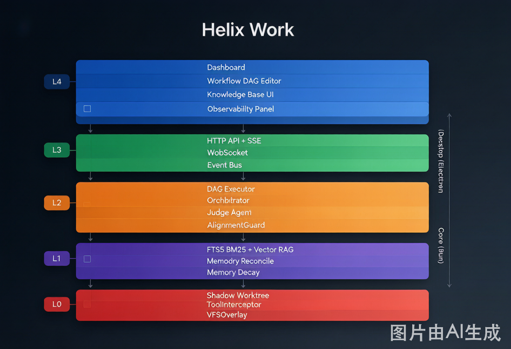
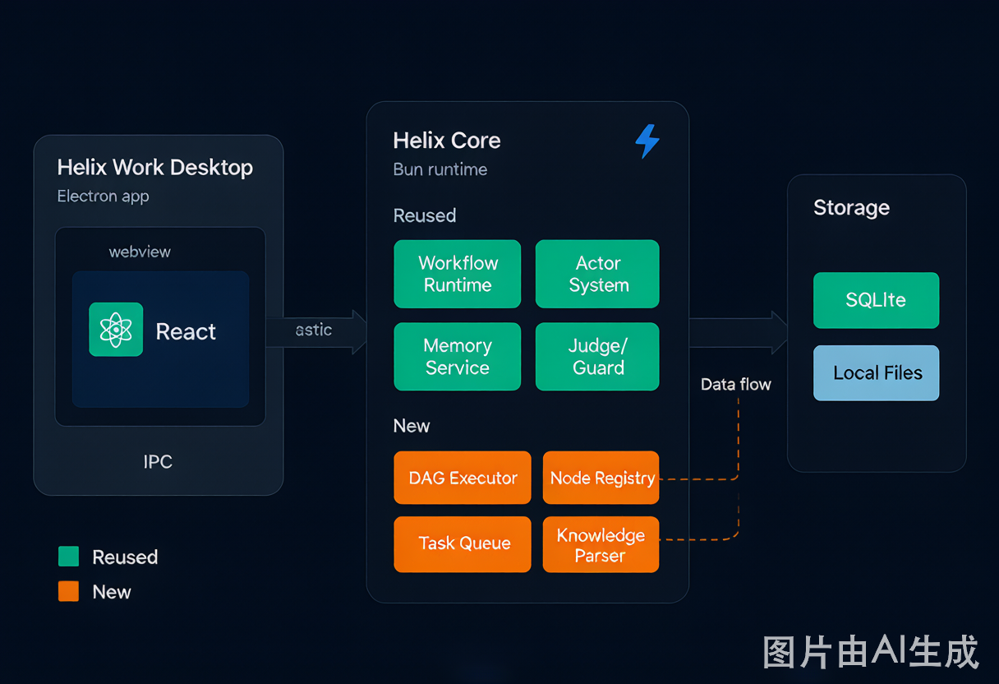
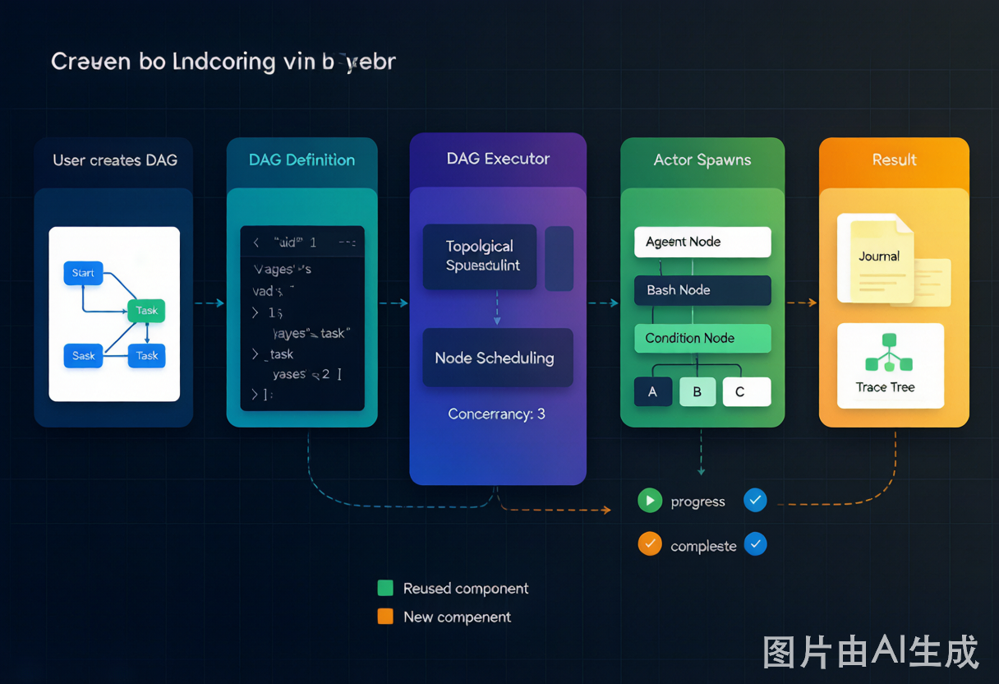

# Helix Work 可执行实施方案

> **文档版本**：v1.0 | 2026-06-22
> **目标**：基于 OpenCode Desktop 构建 Helix Work，对标 Kimi Work / WorkBuddy 的综合任务自动化平台
> **前提**：Helix 智能体 Harness 层（L0-L3）已完备，缺的是可视化编排层和 UI 外化层

---

## 一、项目概述

### 1.1 定位

**Helix Work** = Helix 智能体 Harness 层 + 可视化工作流编排 + 多 Agent 协作 + 知识库 + 任务看板

区别于现有 Helix（IDE 内嵌的代码助手），Helix Work 是一个**独立的桌面应用**，面向非开发者用户，提供：
- 拖拽式工作流编排（零代码）
- 多 Agent 自动协作完成任务
- 知识库管理（文档上传、问答、检索）
- 长时间任务托管（后台运行、状态监控）
- 执行轨迹可视化（用户"看到 Agent 在想什么"）

### 1.2 核心原则

1. **Harness 层复用最大化**：不重复造轮子，安全层、记忆层、控制层、Actor 系统、Workflow Runtime 全部复用现有代码
2. **脚本 + 可视化双模**：可视化编辑器可导出为 JS 脚本，高级用户可手写脚本
3. **渐进增强**：MVP 先完成基础工作流 + 可观测性，再扩展复杂节点和智能编排
4. **与现有 Helix 零侵入共存**：Helix Work 是新增包，不修改现有 `packages/opencode` 核心逻辑，仅通过新增模块扩展；现有 IDE 插件和 TUI 不受影响

---

## 二、功能对标（Kimi Work / WorkBuddy）

| 功能维度 | Kimi Work | Helix Work 对应方案 | 复用/新增 |
|----------|-----------|---------------------|-----------|
| **可视化编排** | DAG 画布，节点拖拽 | `@xyflow/react` 嵌入 Webview，SolidJS 包裹 | 新增前端 |
| **节点类型** | Agent、API、条件、循环、等待 | 复用 `tool/workflow.ts` + 新增 `ConditionNode`、`LoopNode` 等 | 复用+新增 |
| **多 Agent 协作** | 任务分解、并行执行 | 复用 `actor/spawn.ts` + 新增 `Orchestrator` 角色 | 复用+新增 |
| **知识库** | 文档上传、向量化、问答 | 复用 `memory/service.ts` + 新增通用文档解析 | 复用+新增 |
| **长时间任务** | 后台托管、状态通知 | 复用 `workflow/runtime.ts` 的 12h deadline + 新增任务队列 | 复用+新增 |
| **任务看板** | 执行状态、进度追踪 | 复用 `TraceReporter` + 新增可视化面板 | 复用+新增 |
| **执行轨迹** | 步骤日志、耗时分析 | 复用 `TraceNodeEvent` + 新增树状图 UI | 复用+新增 |
| **安全隔离** | 沙箱、权限控制 | 复用 `Shadow Worktree`、`ToolInterceptor`、`VFSOverlay` | ✅ 复用 |
| **偏离纠偏** | 异常检测、告警 | 复用 `AlignmentGuard` + 新增 UI 卡片 | 复用+新增 |
| **质量审计** | 代码审查、结果评估 | 复用 `JudgeAgent` + `Goal.evaluate` | ✅ 复用 |
| **人工审批** | 暂停等待人工确认 | 新增 `HumanApprovalNode` | 新增 |
| **浏览器自动化** | 网页操作、数据抓取 | 新增 `BrowserNode`（Playwright） | 新增 |
| **API 调用** | HTTP 请求、Webhook | 新增 `APINode` | 新增 |
| **IM 通知** | 飞书/企微任务完成通知 | 复用 `packages/feishu-gateway/` | ✅ 复用 |

> **遗漏补充**：Helix Work 的每个 DAG 节点对应一个 **Session** 中的 Agent 调用——DAG 作为编排层，节点作为执行层。一个 DAG Run 对应一个主 Session，子 Agent 节点通过 `Actor.spawn()` 在该 Session 下创建子 Actor。这复用了现有 Session 生命周期和 TaskRegistry 任务管理，无需重新实现任务状态机。

---

## 三、技术架构

### 3.1 总体架构

```
┌─────────────────────────────────────────────────────────────────────┐
│  L4 Presentation  │  Helix Work Desktop (Electron)                   │
│                   │  ├─ Work Dashboard（任务看板）                    │
│                   │  ├─ Workflow Editor（DAG 画布）                    │
│                   │  ├─ Knowledge Base（知识库）                     │
│                   │  └─ Observability Panel（可观测性面板）            │
├─────────────────────────────────────────────────────────────────────┤
│  L3 Access        │  HTTP API + SSE（已有）                            │
│                   │  ├─ Workflow DAG API（新增）                      │
│                   │  ├─ Task Queue API（新增）                         │
│                   │  └─ Knowledge Base API（新增）                     │
├─────────────────────────────────────────────────────────────────────┤
│  L2 Control       │  Hybrid FSM（已有）                                │
│                   │  ├─ DAG Executor（新增）                          │
│                   │  ├─ Orchestrator（新增）                           │
│                   │  ├─ Task Queue Service（新增）                     │
│                   │  ├─ Judge Agent（已有）                              │
│                   │  ├─ AlignmentGuard（已有）                         │
│                   │  └─ ProgressObserver（已有）                       │
├─────────────────────────────────────────────────────────────────────┤
│  L1 Memory        │  SQLite FTS5 + Vector RAG（已有）                   │
│                   │  ├─ 通用文档解析（新增）                           │
│                   │  └─ 知识库索引（扩展 reconcileMemory）              │
├─────────────────────────────────────────────────────────────────────┤
│  L0 Security      │  Shadow Worktree、ToolInterceptor、VFSOverlay（已有）│
└─────────────────────────────────────────────────────────────────────┘
```

### 3.2 与现有 Helix 系统的集成关系

**关键澄清**：Helix Work 不是推翻现有系统，而是在现有 Harness 层上新增**编排层和表现层**。

| 现有系统 | 在 Helix Work 中的角色 | 集成方式 |
|----------|------------------------|----------|
| **Session** (`session/`) | 每个 DAG 节点执行对应一个 Session 中的 Agent 调用 | DAG Executor 通过 `Actor.spawn()` 在 Session 内创建子 Actor |
| **Mode Registry** (`packages/app/src/context/mode-registry.tsx`) | Helix Work 新增 `"work"` 模式，与现有 6 种模式并存 | 前端路由切换：`/` (Helix IDE) ↔ `/work` (Helix Work) |
| **Workflow Runtime** (`workflow/runtime.ts`) | DAG 最终可导出为 `workflow` 工具可执行的脚本 | `dag-script-converter.ts` 将 DAG 序列化为 `workflow.run` 的 `script` 参数 |
| **TaskRegistry** (`task/registry.ts`) | DAG 节点状态映射到 TaskRegistry 的任务状态机 | 节点 pending → Task open；节点 running → Task in_progress；节点 completed → Task done |
| **Plugin** (`plugin/`) | 自定义节点类型通过 Plugin 系统注册 | `NodeRegistry.register()` 与 Plugin Hook 对接 |
| **Memory** (`memory/`) | 知识库文档索引复用现有 FTS5 + Vector | 新增 `scope='knowledge'` 的索引，复用 `search()` API |
| **Event Bus** (`bus/`) | 前后端事件通信复用现有 Bus + SSE | 新增 `WorkEvent` 命名空间：`work.run.started` / `work.node.completed` 等 |

---

### 3.2a 系统架构图



**图 1：Helix Work 六层架构图**

上图展示了 Helix Work 的整体分层架构。Helix Work 新增的能力集中在 **L3 Access 层**（Workflow DAG API、Task Queue API）和 **L4 Presentation 层**（DAG 编辑器、任务看板、知识库 UI、可观测性面板），而 **L0-L2 层**完全复用现有 Helix 的 Harness 层能力。绿色表示复用现有系统，橙色表示新增模块。

---



**图 2：Helix Work 与现有 Helix 系统的集成关系图**

上图展示了 Helix Work 如何与现有 Helix 系统协同工作。绿色框表示完全复用的现有模块，橙色框表示新增的模块。核心集成路径：前端通过 IPC 与 Electron 主进程通信；Electron 主进程通过 HTTP API + SSE 与 Helix Core 通信；Core 内的 DAG Executor 通过 `Actor.spawn()` 调度节点执行；节点执行通过 `Bus` 发布事件，前端通过 SSE 实时接收。

---

### 3.3 模块划分

#### 前端（`packages/helix-work/` + `packages/app-work/`）

| 模块 | 技术栈 | 说明 |
|------|--------|------|
| **Desktop Shell** | Electron + electron-vite | 复制 `packages/desktop/`，修改应用名称和入口 |
| **Work Dashboard** | SolidJS + Tailwind | 任务列表、状态卡片、运行历史 |
| **Workflow Editor** | `@xyflow/react` + SolidJS 包裹 | DAG 画布，节点拖拽、连线、属性面板 |
| **Knowledge Base** | SolidJS + `marked` | 文档上传、分块预览、问答界面 |
| **Observability Panel** | SolidJS + `d3`/`echarts` | Trace 树、AlignmentGuard 告警、Judge 裁决 |

#### 后端（`packages/opencode/` 新增模块）

| 模块 | 文件路径 | 说明 |
|------|----------|------|
| **DAG Executor** | `workflow/dag-executor.ts` | 拓扑排序、节点调度、状态机 |
| **Node Registry** | `workflow/node-registry.ts` | 节点类型注册（Agent/Bash/Condition/Loop/Wait/Human/API/Browser） |
| **Task Queue** | `task/queue.ts` + `task/queue.sql.ts` | SQLite 持久化任务队列，后台 dequeue → 执行 |
| **Orchestrator** | `orchestrator/` | 任务分解（DecompositionGate）、子任务分配、结果聚合 |
| **Knowledge Base** | `knowledge/` | 通用文档解析（PDF/DOCX/XLSX）、知识库管理 API |
| **Browser Tool** | `tool/browser.ts` | Playwright 封装，浏览器自动化节点 |
| **API Tool** | `tool/api.ts` | HTTP 请求节点，支持 REST/GraphQL |

---

## 四、详细实施阶段

### Phase 1：基础底座（Week 1-2）

**目标**：Clone Desktop，建立 Helix Work 项目结构，接入 Helix Core

#### 4.1.1 复制 Desktop 包

```bash
# 复制 packages/desktop 到 packages/helix-work
cp -r packages/desktop packages/helix-work
```

**修改文件清单**：

| 文件 | 修改内容 |
|------|----------|
| `packages/helix-work/package.json` | `name` 改为 `@mimo-ai/helix-work`，版本重置为 `0.1.0` |
| `packages/helix-work/README.md` | 替换为 Helix Work 说明 |
| `packages/helix-work/electron-builder.config.ts` | 修改 `appId`、`productName` 为 `ai.helix.work` |
| `packages/helix-work/src/main/index.ts` | 修改 `APP_NAMES`/`APP_IDS` 为 Helix Work |
| `packages/helix-work/src/main/windows.ts` | `createMainWindow` 加载新的 Work UI 入口 |
| `packages/helix-work/src/main/server.ts` | 复用，无需修改（Core 启动逻辑不变） |
| `packages/helix-work/src/main/ipc.ts` | 新增 IPC 通道：`workflow:*`、`knowledge:*`、`task-queue:*` |
| `packages/helix-work/src/preload/index.ts` | **新增 IPC 类型定义和暴露方法**（安全白名单） |
| `packages/helix-work/electron.vite.config.ts` | **修改 renderer 入口，新增 Work UI 构建目标** |
| `package.json` (root) | **workspaces 添加 `packages/helix-work`** |
| `packages/app/package.json` | **新增 `@mimo-ai/helix-work` 作为 devDependency**（可选，用于类型共享） |

#### 4.1.2 修改 Electron 构建配置

**`packages/helix-work/electron.vite.config.ts`**：

```typescript
// 修改 renderer 入口，新增 Work UI 构建目标
export default defineConfig({
  // ... main 配置不变
  renderer: {
    // ... 现有配置
    build: {
      rollupOptions: {
        input: {
          main: "src/renderer/index.html",
          loading: "src/renderer/loading.html",
          // 新增 Work UI 入口（可选：若 Work UI 通过路由切换则不需要）
          // work: "src/renderer/work.html",
        },
      },
    },
  },
})
```

**`packages/helix-work/src/preload/index.ts`**：

新增 IPC 类型定义和暴露方法（安全白名单）：

```typescript
// 新增 Work 相关的 IPC 通道
export interface WorkAPI {
  // Workflow
  'workflow:list': () => Promise<WorkflowDefinition[]>
  'workflow:get': (id: string) => Promise<WorkflowDefinition>
  'workflow:save': (def: WorkflowDefinition) => Promise<void>
  'workflow:run': (id: string) => Promise<{ runID: string }>
  'workflow:cancel': (runID: string) => Promise<void>
  // Task Queue
  'task-queue:list': () => Promise<QueuedTask[]>
  'task-queue:enqueue': (task: EnqueueInput) => Promise<void>
  // Knowledge
  'knowledge:upload': (file: File) => Promise<{ docID: string }>
  'knowledge:search': (query: string) => Promise<SearchResult[]>
  'knowledge:ask': (question: string) => Promise<string>
}

// 在 contextBridge.exposeInMainWorld 中注册
contextBridge.exposeInMainWorld('workAPI', {
  // ... 新增 Work IPC 方法
})
```

#### 4.1.4 新增 Work UI 入口

在 `packages/app/` 中新增 Work 模式的路由和页面：

```
packages/app/src/
  pages/
    work/
      dashboard.tsx          # 任务看板
      workflow-editor.tsx    # DAG 编辑器
      knowledge-base.tsx     # 知识库
      observability.tsx      # 可观测性面板
  context/
    work-state.tsx           # Work 全局状态（任务列表、运行状态）
    workflow-editor.tsx      # 编辑器状态（DAG 数据、选中节点）
```

**路由配置**（`app.tsx`）：

```tsx
const WorkRoute = lazy(() => import("@/pages/work"))
// 在 Router 中添加
<Route path="/work" component={WorkRoute} />
<Route path="/work/dashboard" component={DashboardPage} />
<Route path="/work/workflow/:id" component={WorkflowEditorPage} />
<Route path="/work/knowledge" component={KnowledgeBasePage} />
<Route path="/work/observability" component={ObservabilityPage} />
```

#### 4.1.5 构建验证

```bash
# 添加 workspace 依赖
# 在 root package.json workspaces 中添加 "packages/helix-work"

bun install
cd packages/helix-work && bun dev
```

**验收标准**：
- `bun dev` 启动后显示 Helix Work 窗口（标题为 "Helix Work"）
- 侧边栏导航包含：Dashboard、Workflows、Knowledge Base、Observability
- 可以正常连接到 Helix Core（health check 通过）

---

### Phase 2：可视化工作流编排（Week 3-5）

**目标**：实现 DAG 编辑器 + 后端 DAG Executor，支持基础节点类型

#### 4.2.1 前端：DAG 编辑器

**技术选型**：`@xyflow/react`（React Flow 新版）通过 iframe 或 SolidJS wrapper 嵌入。

**文件清单**：

```
packages/app/src/pages/work/
  workflow-editor.tsx
  components/
    dag-canvas.tsx           # React Flow 画布容器
    dag-node.tsx             # 自定义节点组件（Agent/Bash/Condition/Loop/Wait）
    dag-edge.tsx             # 自定义边组件（条件分支标注）
    properties-panel.tsx     # 右侧属性面板
    toolbar.tsx              # 顶部工具栏（保存/运行/暂停）
    mini-map.tsx             # 缩略图
  hooks/
    use-dag-state.ts         # DAG 数据管理（节点、边、位置）
    use-workflow-run.ts      # 工作流运行状态（SSE 订阅）
  types/
    dag.ts                   # 节点/边数据类型定义
```

**DAG 数据格式**（与后端共享）：

```typescript
interface DAGNode {
  id: string
  type: 'agent' | 'bash' | 'condition' | 'loop' | 'wait' | 'human' | 'api' | 'browser'
  position: { x: number; y: number }
  data: {
    name: string
    config: Record<string, unknown>  // 节点类型特定配置
  }
}

interface DAGEdge {
  id: string
  source: string
  target: string
  label?: string  // 条件分支标签（如 "true" / "false"）
  type?: 'default' | 'conditional'
}

interface WorkflowDefinition {
  id: string
  name: string
  nodes: DAGNode[]
  edges: DAGEdge[]
  layout?: Record<string, { x: number; y: number }>  // **UI 布局数据单独存储，后端执行时可忽略**
  version: number
  createdAt: number
  updatedAt: number
}
```

#### 4.2.2 后端：DAG Executor

**新增文件**：

```
packages/opencode/src/workflow/
  dag-executor.ts          # 核心执行引擎
  node-registry.ts          # 节点类型注册表
  node-handlers/
    agent-node.ts            # Agent 节点执行逻辑
    bash-node.ts             # Bash 节点执行逻辑
    condition-node.ts        # 条件分支节点
    loop-node.ts             # 循环节点
    wait-node.ts             # 等待/定时节点
    human-node.ts            # 人工审批节点
    api-node.ts              # HTTP 请求节点
    browser-node.ts          # 浏览器自动化节点
```

**DAG Executor 核心逻辑**（`dag-executor.ts`）：

```typescript
// 1. 拓扑排序（Kahn 算法）
// 2. 按拓扑顺序调度节点
// 3. 每个节点 = 一个 Effect 任务，通过 Actor 系统执行
// 4. 条件分支：根据 ConditionNode 输出决定 next edge
// 5. 循环节点：LoopNode 内部子图重复执行，直到条件满足
// 6. 并发节点：无依赖关系的节点并行执行（利用 Actor 并发）
// 7. 状态持久化：每个节点执行结果写入 SQLite（workflow_run_node 表）
// 8. 事件流：通过 Bus 发布 TraceNodeEvent，前端 SSE 订阅
```

**节点注册表**（`node-registry.ts`）：

```typescript
export interface NodeHandler<TConfig = unknown> {
  readonly type: string
  readonly execute: (
    config: TConfig,
    context: NodeContext,
  ) => Effect.Effect<NodeOutput>
  readonly validate?: (config: TConfig) => Effect.Effect<void>
}

export const NodeRegistry = {
  register: (handler: NodeHandler) => Effect.Effect<void>
  resolve: (type: string) => Effect.Effect<NodeHandler>
}
```

**插件系统扩展**：自定义节点类型通过 `plugin/` Hook 注册。

```typescript
// 在 Plugin Hook 中注册自定义节点
Plugin.registerHook('workflow.node.register', (ctx) => {
  NodeRegistry.register({
    type: 'custom-node',
    execute: (config, context) => {
      // 自定义节点执行逻辑
    }
  })
})
```

这样第三方插件可以扩展 DAG 节点类型，无需修改核心代码。

#### 4.2.3 DAG 与现有 Workflow Runtime 的集成

**关键设计**：`workflow/runtime.ts` 的 `start()` 接收 `script: string`（JS 脚本），而 DAG Executor 按拓扑调度节点。两者的集成路径：

```
用户保存 DAG → dag-script-converter.ts 生成脚本 → 存入 workflow_definition.script
用户运行 DAG → DAG Executor 直接按拓扑调度节点（不经过 workflow/runtime.ts）
用户导出脚本 → workflow_definition.script 可直接被 workflow 工具执行
```

即：**DAG 运行时独立调度**（不走 `workflow/runtime.ts`），但 **DAG 可导出为脚本供 workflow 工具复用**。

这种设计的优势：
- DAG 执行是原生拓扑调度，性能更好（无需 JS 解释器）
- 复杂节点（Condition、Loop、Human）在 DAG 层原生实现，不需要脚本语法
- 脚本模式作为兼容层保留，供高级用户和现有 workflow 工具使用

#### 4.2.4 脚本 ↔ DAG 双向转换

**新增文件**：`packages/opencode/src/workflow/dag-script-converter.ts`

- **DAG → Script**：遍历节点拓扑序，生成 `export const meta = {...}` + `agent()`/`bash()` 调用的 JS 脚本
- **Script → DAG**：解析 JS 脚本中的 `agent()`/`bash()` 调用，重建节点和边

这样可视化编辑器可以导出为脚本，手写脚本也可以导入为 DAG。

#### 4.2.5 数据表扩展

**新增表**（`workflow/workflow.sql.ts`）：

```sql
-- 工作流定义表（已有 workflow_run，新增 workflow_definition）
CREATE TABLE workflow_definition (
  id TEXT PRIMARY KEY,
  name TEXT NOT NULL,
  dag_json TEXT NOT NULL,        -- DAG 序列化 JSON（不含 position，纯执行数据）
  layout_json TEXT,              -- **UI 布局数据单独存储（position、zoom、viewport）**
  script TEXT,                    -- 对应的 JS 脚本（可选）
  version INTEGER NOT NULL DEFAULT 1,
  created_at INTEGER NOT NULL,
  updated_at INTEGER NOT NULL
);

-- 工作流运行节点状态表
CREATE TABLE workflow_run_node (
  id TEXT PRIMARY KEY,
  run_id TEXT NOT NULL REFERENCES workflow_run(id),
  node_id TEXT NOT NULL,          -- DAG 中的节点 id
  status TEXT NOT NULL,           -- pending / running / completed / failed / skipped
  output TEXT,                    -- JSON 序列化输出
  started_at INTEGER,
  completed_at INTEGER,
  error TEXT
);
```

**验收标准**：
- 可以在画布上拖拽创建 Agent 节点和 Bash 节点
- 可以连线定义执行顺序
- 点击"运行"后，工作流按拓扑序执行
- 前端实时显示每个节点的状态（pending → running → completed/failed）
- 可以导出为 JS 脚本，脚本可以正常运行

---

#### 4.2.6 DAG 执行流程图



**图 3：DAG 从定义到执行的完整流程**

上图展示了 DAG 从用户创建到最终完成的完整生命周期。核心路径：
1. **用户创建 DAG**：在可视化编辑器中拖拽节点、连线
2. **DAG 定义序列化**：保存为 `WorkflowDefinition` JSON（节点+边，不含 UI 坐标）
3. **DAG Executor 调度**：拓扑排序确定执行顺序，按依赖关系调度节点
4. **Actor 并发执行**：每个就绪节点通过 `Actor.spawn()` 启动子 Agent 并行执行
5. **Bus 事件流**：节点状态变化（pending → running → completed/failed）通过 `Bus` 实时发布
6. **结果持久化**：执行日志写入 `Journal`，Trace 事件写入归档，最终返回结果

---

### Phase 3：多 Agent 编排与长时间任务（Week 6-7）

**目标**：实现 Orchestrator 任务分解 + 任务队列持久化

#### 4.3.1 Orchestrator 编排器

**新增文件**：

```
packages/opencode/src/orchestrator/
  index.ts                   # Orchestrator Service 定义
  decompose.ts               # 任务分解（DecompositionGate）
  assign.ts                  # 子任务分配给子 Agent
  aggregate.ts               # 结果聚合
  retry.ts                   # 失败重试策略
```

**核心逻辑**：

1. 用户输入任务描述
2. Orchestrator（主 Agent）分析任务，分解为子任务列表
3. 每个子任务 = 一个 Workflow 节点或独立的 Actor spawn
4. DAG Executor 调度子任务并行/串行执行
5. 子任务结果通过 Actor inbox 返回给 Orchestrator
6. Orchestrator 判断是否需要补充任务或重新分解
7. 最终结果汇总返回给用户

**与现有 Actor 系统的集成**：

```typescript
// 复用 actor/spawn.ts 的 spawn 机制
const subAgents = yield* Effect.forEach(subTasks, (task) =>
  Actor.spawn({
    agent: task.agentType,
    prompt: task.description,
    parentActorID: orchestratorID,
  })
)

// 等待所有子 Agent 返回
const results = yield* Effect.forEach(subAgents, (agent) =>
  Actor.wait(agent.actorID, { timeout: task.timeoutMs })
)
```

#### 4.3.2 任务队列（长时间任务托管）

**新增文件**：

```
packages/opencode/src/task/
  queue.ts                   # TaskQueue Service
  queue.sql.ts               # 数据库表定义
  worker.ts                  # 后台 Worker（dequeue → 执行）
```

**核心逻辑**：

```typescript
// 1. 工作流提交到队列
yield* TaskQueue.enqueue({
  workflowID: "wf_xxx",
  priority: "normal",
  scheduledAt: Date.now(),  // 或未来的时间戳（定时任务）
})

// 2. 后台 Worker 定期 dequeue
const task = yield* TaskQueue.dequeue()
if (task) {
  yield* DAGExecutor.run(task.workflowID)
}

// 3. 任务状态写入 SQLite，前端轮询或 SSE 订阅
```

**数据表**：

```sql
CREATE TABLE task_queue (
  id TEXT PRIMARY KEY,
  workflow_id TEXT NOT NULL,
  status TEXT NOT NULL,         -- pending / running / completed / failed / cancelled
  priority TEXT NOT NULL DEFAULT 'normal',
  scheduled_at INTEGER NOT NULL,
  started_at INTEGER,
  completed_at INTEGER,
  error TEXT,
  retry_count INTEGER DEFAULT 0
);
```

**验收标准**：
- 提交一个复杂任务后，Orchestrator 自动分解为多个子任务
- 子任务在 DAG 画布上展示为并行执行的节点
- 关闭窗口后，任务在后台继续运行（通过 Task Queue）
- 重新打开应用后，可以在 Dashboard 看到任务进度和结果

#### 4.3.3 飞书 Gateway 集成（任务通知）

**复用现有**：`packages/feishu-gateway/` 已支持 WebSocket 消息推送。

**新增集成点**：

```typescript
// 1. 任务完成时发送飞书通知
Bus.subscribe('work.run.completed', (event) => {
  FeishuGateway.sendMessage({
    userID: event.userID,
    content: `工作流「${event.workflowName}」已完成，结果：${event.status}`,
    link: `opencode://work/observability?runID=${event.runID}`
  })
})

// 2. 人工审批节点发送审批请求
Bus.subscribe('workflow.node.awaiting_approval', (event) => {
  FeishuGateway.sendApprovalCard({
    userID: event.userID,
    title: `工作流「${event.workflowName}」需要您的审批`,
    buttons: ['同意', '拒绝'],
    callbackURL: `http://localhost:3095/api/v1/work/approval/${event.approvalID}`
  })
})
```

**配置**：在 `mimocode.json` 中增加 `feishu` 配置项：

```json
{
  "helix_work": {
    "feishu": {
      "enabled": true,
      "gateway_url": "http://localhost:3096",
      "notify_on_complete": true,
      "notify_on_failure": true,
      "approval_timeout_minutes": 60
    }
  }
}
```

**验收标准**：
- 工作流完成/失败时，自动发送飞书消息通知用户
- 人工审批节点触发时，用户在飞书中收到审批卡片，点击按钮即可响应
- 工作流完成/失败时，自动发送飞书消息通知用户
- 人工审批节点触发时，用户在飞书中收到审批卡片，点击按钮即可响应
      - 紧急模式通知：无论用户设置如何，失败时总是发送通知
- 审批响应后，工作流自动恢复执行

---

**目标**：通用文档上传、解析、索引、问答

#### 4.4.1 文档解析

**新增文件**：

```
packages/opencode/src/knowledge/
  parser/
    pdf.ts                     # pdf-parse 封装
    docx.ts                    # mammoth 封装
    xlsx.ts                    # xlsx 封装
    markdown.ts                # 已有，复用
    text.ts                    # 纯文本
  index.ts                     # Knowledge Service
  api.ts                       # HTTP API 路由
```

**核心逻辑**：

```typescript
// 1. 上传文档 → 解析为文本
const text = yield* Knowledge.parse(file, { type: 'pdf' })

// 2. 文本分块（按语义段落或固定 token 数）
const chunks = yield* Knowledge.chunk(text, { chunkSize: 512, overlap: 64 })

// 3. 写入 Memory 系统（复用现有 FTS5 + Vector 索引）
for (const chunk of chunks) {
  yield* Memory.index({
    path: `${docID}/chunk_${i}`,
    body: chunk,
    scope: 'knowledge',
    scope_id: docID,
    type: 'document',
  })
}
```

#### 4.4.2 知识库问答

**复用现有 RAG**：

```typescript
// 用户提问 → 检索知识库 → 组装 context → 调用 Agent
const results = yield* Memory.search({
  query: userQuestion,
  scope: 'knowledge',
  limit: 5,
})

const context = results.map(r => r.snippet).join('\n---\n')

const answer = yield* Agent.ask({
  prompt: `基于以下知识库内容回答问题：\n\n${context}\n\n问题：${userQuestion}`,
})
```

#### 4.4.3 前端 UI

**文件清单**：

```
packages/app/src/pages/work/
  knowledge-base.tsx
  components/
    doc-upload.tsx             # 文件上传拖拽区
    doc-list.tsx               # 文档列表（名称、状态、分块数）
    doc-preview.tsx            # 文档分块预览
    qa-panel.tsx               # 问答界面（输入框 + 答案展示 + 来源引用）
```

**验收标准**：
- 可以上传 PDF/DOCX/XLSX/TXT 文件
- 文档自动解析、分块、索引
- 在问答界面提问，Agent 基于知识库内容回答
- 答案附带来源引用（哪篇文档、哪个分块）

---

### Phase 5：可观测性 UI 外化（Week 10-11）

**目标**：让用户"看到 Agent 在想什么"

#### 4.5.1 执行轨迹树（Trace Tree）

**复用后端**：`observability/trace-reporter.ts` 已发布 `TraceNodeEvent`

**前端新增**：

```
packages/app/src/pages/work/
  observability.tsx
  components/
    trace-tree.tsx             # 树状图（d3 或自定义组件）
    trace-node-detail.tsx      # 节点详情（输入/输出/耗时）
    trace-timeline.tsx         # 时间线视图（Gantt 图）
```

**数据流**：

```
Backend: TraceReporter.emitTrace() → Bus → SSE
Frontend: SSE 订阅 → trace-tree 组件实时更新
```

#### 4.5.2 AlignmentGuard 告警面板

**复用后端**：`observability/alignment-guard.ts` 已发布 `AlignmentAlert`

**前端新增**：

```
packages/app/src/pages/work/components/
  alignment-alert-card.tsx   # 告警卡片（warn/critical 两级）
  alignment-alert-list.tsx   # 告警列表（时间线）
```

**设计参考**：`docs/ide-ui-design.md` §5.13（状态栏脉冲 + 可展开卡片）

#### 4.5.3 Judge 裁决面板

**复用后端**：`agent/judge-agent.ts` 和 `session/goal.ts`

**前端新增**：

```
packages/app/src/pages/work/components/
  judge-verdict-card.tsx     # 裁决卡片（紫色边框，通过/驳回/存疑）
  goal-status-panel.tsx      # 目标状态面板（进度 + 最近一次 Judge 结果）
```

**设计参考**：`docs/ide-ui-design.md` §5.12

#### 4.5.4 任务看板（Dashboard）

```
packages/app/src/pages/work/
  dashboard.tsx
  components/
    task-card.tsx              # 任务卡片（名称、状态、进度、耗时）
    task-filter.tsx            # 筛选器（状态/时间/类型）
    stats-overview.tsx         # 统计概览（总任务/成功/失败/运行中）
```

**验收标准**：
- Dashboard 显示所有任务列表，支持筛选和搜索
- 点击任务进入 Trace 树，可展开每个节点查看输入/输出/耗时
- AlignmentGuard 告警实时推送，显示为可展开的卡片
- Judge 裁决结果以紫色卡片展示，包含裁决理由
- 任务看板支持实时刷新（SSE 或 WebSocket）

---

### Phase 6：高级节点与扩展（Week 12-14）

**目标**：补充 Human Approval、Browser、API 等高级节点

#### 4.6.1 人工审批节点（Human Approval）

**后端**：`workflow/node-handlers/human-node.ts`

```typescript
// 执行到 HumanNode 时：
// 1. 暂停工作流（状态设为 awaiting_approval）
// 2. 通过 Bus 发送 HumanApprovalRequested 事件
// 3. 前端弹出审批对话框（同意/拒绝/附带备注）
// 4. 用户响应后，通过 API 发送审批结果
// 5. 工作流恢复执行
```

**前端**：`packages/app/src/pages/work/components/human-approval-dialog.tsx`

#### 4.6.2 浏览器自动化节点（Browser）

**后端**：`tool/browser.ts`（新增）

```typescript
// 基于 Playwright 封装
export const BrowserTool = Tool.define({
  id: 'browser',
  parameters: z.object({
    operation: z.enum(['navigate', 'click', 'type', 'screenshot', 'extract', 'scroll']),
    url: z.string().optional(),
    selector: z.string().optional(),
    text: z.string().optional(),
  }),
  execute: async (input) => {
    const browser = await chromium.launch({ headless: true })
    const page = await browser.newPage()
    // ... 执行操作
    return { result, screenshot: base64 }
  }
})
```

**前端**：节点属性面板支持 URL 输入、选择器输入、操作类型选择。

#### 4.6.3 API 节点（HTTP 请求）

**后端**：`tool/api.ts`（新增）

```typescript
export const APITool = Tool.define({
  id: 'api',
  parameters: z.object({
    method: z.enum(['GET', 'POST', 'PUT', 'DELETE']),
    url: z.string(),
    headers: z.record(z.string()).optional(),
    body: z.string().optional(),
  }),
  execute: async (input) => {
    const res = await fetch(input.url, { method: input.method, headers: input.headers, body: input.body })
    return { status: res.status, body: await res.text() }
  }
})
```

#### 4.6.4 MCP 节点（动态工具接入）

复用现有 `mcp/` 实现，将 MCP Server 的工具动态注册为 DAG 节点类型。

**验收标准**：
- Human 节点执行时，前端弹出审批对话框，用户响应后工作流继续
- Browser 节点可以打开网页、点击元素、截图、提取文本
- API 节点可以调用外部 REST API，支持自定义 headers
- MCP 节点可以动态接入外部工具（如 GitHub、Slack 等）

---

## 五、文件/目录变更总清单

### 5.1 新增包

```
packages/helix-work/              # 从 packages/desktop/ 复制并修改
  package.json                    # 修改 name, version, appId
  README.md                       # 新文档
  electron-builder.config.ts      # 修改 appId, productName
  electron.vite.config.ts         # **修改 renderer 入口配置**
  src/main/index.ts               # 修改 APP_NAMES/APP_IDS
  src/main/windows.ts             # 修改入口加载逻辑
  src/main/ipc.ts                 # 新增 workflow/knowledge/task-queue IPC
  src/preload/index.ts            # **新增 Work IPC 类型定义和暴露方法**
  src/preload/types.ts            # 新增类型定义

packages/app/src/pages/work/     # 新增 Work UI 页面
  dashboard.tsx
  workflow-editor.tsx
  knowledge-base.tsx
  observability.tsx
  components/                     # 各页面的子组件
  hooks/                          # 状态管理 hooks
  types/                          # 类型定义
```

### 5.2 后端新增文件

```
packages/opencode/src/workflow/
  dag-executor.ts                 # DAG 执行引擎
  node-registry.ts                # 节点类型注册表
  node-handlers/
    agent-node.ts
    bash-node.ts
    condition-node.ts
    loop-node.ts
    wait-node.ts
    human-node.ts
    api-node.ts
    browser-node.ts
  dag-script-converter.ts         # DAG ↔ 脚本双向转换

packages/opencode/src/orchestrator/
  index.ts
  decompose.ts
  assign.ts
  aggregate.ts
  retry.ts

packages/opencode/src/task/
  queue.ts
  queue.sql.ts
  worker.ts

packages/opencode/src/knowledge/
  parser/
    pdf.ts
    docx.ts
    xlsx.ts
  index.ts
  api.ts

packages/opencode/src/tool/
  browser.ts                      # 浏览器自动化工具
  api.ts                          # HTTP 请求工具

packages/opencode/src/server/routes/
  instance/
    dag.ts                          # DAG 定义 CRUD API
    task-queue.ts                   # 任务队列 API
    knowledge.ts                    # 知识库 API
```

### 5.3 数据库变更

```sql
-- 新增表
workflow_definition
workflow_run_node
task_queue

-- 扩展表
-- workflow_run 表：增加 orchestrator_id、parent_workflow_id 字段
-- memory 表索引：增加 scope='knowledge' 的查询支持
```

---

## 六、工期与资源

### 6.1 总工期

| 阶段 | 内容 | 工期 | 累积 |
|------|------|------|------|
| Phase 1 | 基础底座（Clone Desktop + 项目结构） | 2 周 | 2 周 |
| Phase 2 | 可视化工作流编排（DAG + 基础节点） | 3 周 | 5 周 |
| Phase 3 | 多 Agent 编排 + 长时间任务 | 2 周 | 7 周 |
| Phase 4 | 知识库 | 2 周 | 9 周 |
| Phase 5 | 可观测性 UI 外化 | 2 周 | 11 周 |
| Phase 6 | 高级节点（Human/Browser/API/MCP） | 3 周 | 14 周 |

**MVP（Phase 1-3）**：7 周（含基础工作流 + 多 Agent + 长时间任务）
**完整版（Phase 1-6）**：14 周（约 3.5 个月）

### 6.2 人员配置

| 角色 | 人数 | 职责 |
|------|------|------|
| 前端工程师 | 1 | SolidJS + React Flow 画布、Dashboard、知识库 UI |
| 后端工程师 | 1 | DAG Executor、Node Registry、Task Queue、Orchestrator |
| 全栈工程师 | 1 | 集成调试、文档解析、可观测性面板、测试 |

**3 人团队，14 周完成完整版。**

### 6.3 关键依赖

| 依赖 | 版本 | 用途 |
|------|------|------|
| `@xyflow/react` | ^12 | DAG 可视化编辑器 |
| `pdf-parse` | ^1 | PDF 解析 |
| `mammoth` | ^1 | DOCX 解析 |
| `xlsx` | ^0.18 | XLSX 解析 |
| `playwright` | ^1 | 浏览器自动化 |
| `d3` | ^7 | Trace 树可视化 |
| `echarts` | ^5 | 统计图表 |

---

## 七、性能指标与资源配额

### 7.1 性能指标

| 指标 | 目标值 | 说明 |
|------|--------|------|
| **DAG 最大节点数** | 200 | 超过时提示拆分工作流 |
| **DAG 并发执行节点数** | 16 | 复用现有 `maxConcurrentAgents=16` |
| **单节点最大执行时间** | 2h | 复用 `agentTimeoutMs`，可配置 |
| **工作流总 deadline** | 12h | 复用 `scriptDeadlineMs` |
| **知识库最大文档大小** | 100MB | 超过时拒绝上传并提示 |
| **知识库最大文档数** | 10,000 | 超过时提示归档或清理 |
| **单文档分块上限** | 1,000 块 | 每块 512 tokens，overlap 64 |
| **任务队列最大并发** | 5 | 后台 Worker 同时执行 5 个任务 |
| **Trace 事件最大保留** | 10,000 / Session | 超过时自动归档到文件 |
| **Dashboard 刷新延迟** | < 2s | SSE 或 2s 轮询 |

### 7.2 资源配额管理

**新增模块**：`packages/opencode/src/workflow/resource-guard.ts`

```typescript
// 1. 每个 DAG Run 的资源配额
interface ResourceQuota {
  maxAgents: number       // 生命周期 Agent 上限（默认 1000）
  maxConcurrent: number   // 并发节点上限（默认 16）
  maxMemoryMB: number     // VFSOverlay 内存上限
  maxDiskMB: number       // Shadow Worktree 磁盘上限
  maxNetworkReqs: number // 网络请求上限（防止爬虫滥用）
}

// 2. 配额超限时的行为
// - warn：记录日志，继续执行
// - pause：暂停工作流，等待用户确认
// - fail：终止工作流，标记失败
```

---

## 八、测试策略

> **核心原则**：禁止 mock，必须调用真实业务代码验证。

### 8.1 单元测试

| 模块 | 测试文件 | 覆盖内容 |
|------|----------|----------|
| DAG Executor | `test/workflow/dag-executor.test.ts` | 拓扑排序、节点调度、并发控制 |
| Node Registry | `test/workflow/node-registry.test.ts` | 注册/解析、类型验证 |
| Script Converter | `test/workflow/dag-script-converter.test.ts` | DAG → Script → DAG 往返一致性 |
| Task Queue | `test/task/queue.test.ts` | enqueue/dequeue/幂等执行 |
| Knowledge Parser | `test/knowledge/parser.test.ts` | PDF/DOCX/XLSX 解析准确性 |

### 8.2 集成测试

| 场景 | 测试文件 | 验证内容 |
|------|----------|----------|
| 完整工作流 | `test/workflow/e2e-simple-dag.test.ts` | 创建 DAG → 运行 → 验证结果 |
| 多 Agent 编排 | `test/orchestrator/e2e-decompose.test.ts` | 提交任务 → 分解 → 并行执行 → 聚合 |
| 长时间任务 | `test/task/e2e-background.test.ts` | 关闭窗口 → 后台运行 → 重新打开看到进度 |
| 知识库问答 | `test/knowledge/e2e-qa.test.ts` | 上传文档 → 索引 → 提问 → 验证答案 |

### 8.3 端到端测试（Desktop）

| 场景 | 工具 | 验证内容 |
|------|------|----------|
| Desktop 启动 | Playwright Electron | 应用启动 → 加载 Work UI → health check |
| DAG 编辑器 | Playwright | 拖拽节点 → 连线 → 保存 → 运行 |
| 可观测性面板 | Playwright | 运行工作流 → 查看 Trace 树 → 验证节点状态 |
| 跨会话持久化 | Playwright | 运行任务 → 关闭应用 → 重启 → 查看进度 |

### 8.4 测试数据

```
test-data/
  workflow/
    simple-agent-bash.json       # 2 节点 DAG
    conditional-branch.json      # 条件分支 DAG
    parallel-fanout.json         # 并发执行 DAG
    loop-iteration.json          # 循环节点 DAG
  knowledge/
    sample.pdf                   # 测试 PDF（< 1MB）
    sample.docx                  # 测试 DOCX
    sample.xlsx                  # 测试 XLSX
```

---

## 九、风险与对策
|------|------|------|
| React Flow 与 SolidJS 集成困难 | 中 | iframe 隔离方案；或迁移到 React（长期） |
| DAG 复杂场景（循环、嵌套）调度 bug | 中 | 先实现简单 DAG，复杂场景用脚本模式兜底 |
| 长时间任务 Worker 崩溃恢复 | 中 | Task Queue 持久化 + 幂等执行 + 状态机重入 |
| 文档解析大文件 OOM | 中 | 流式解析 + 分块限制 + 进度通知 |
| 前端与 Core 进程通信延迟 | 低 | Desktop 是进程中加载，latency 已最低 |
| 与现有 Helix 代码冲突 | 低 | 新增模块隔离，不修改现有核心逻辑 |
| **Helix Core 版本同步** | **高** | **Helix Work 锁定 Core 版本，跟随 Core 发版节奏同步升级** |
| **Electron 升级 API 破坏** | **中** | **锁定 Electron 版本至 41.x，升级前做完整回归测试** |
| **Playwright-Electron 集成** | **中** | **Browser 节点使用 Playwright 独立进程（非 Electron 内嵌），避免冲突** |
| **资源配额超限** | **中** | **ResourceGuard 自动 pause/fail，Dashboard 提示用户** |
| **知识库隐私合规** | **低** | **文档本地存储，不上传云端；用户可控删除索引** |
| **多工作区数据隔离** | **低** | **每个工作区独立 Shadow Worktree + 独立 MIMOCODE_HOME** |
| **数据库 Schema 迁移** | **低** | **复用现有 `migrate.ts`，新增表走 Drizzle 迁移脚本** |

---

## 十、验收标准

### MVP 验收（Phase 1-3 结束）

1. ✅ 可以启动 Helix Work 桌面应用，显示独立的 Work UI
2. ✅ 可以在 DAG 画布上拖拽创建 Agent 和 Bash 节点，连线定义顺序
3. ✅ 点击"运行"后，工作流按拓扑序执行，前端实时显示节点状态
4. ✅ 可以导出工作流为 JS 脚本，脚本可正常运行
5. ✅ 提交复杂任务后，Orchestrator 自动分解为多个子任务并行执行
6. ✅ 关闭窗口后，任务在后台继续运行，重新打开可以看到进度
7. ✅ 每个节点的执行结果可以在 Trace 树中查看

### 完整版验收（Phase 1-6 结束）

1. ✅ 所有 MVP 验收项通过
2. ✅ 支持知识库上传（PDF/DOCX/XLSX/TXT），问答基于知识库
3. ✅ 可观测性面板包含：Trace 树、AlignmentGuard 告警、Judge 裁决、任务统计
4. ✅ 支持 Human Approval 节点（工作流暂停等待用户确认）
5. ✅ 支持 Browser 节点（网页自动化）和 API 节点（HTTP 请求）
6. ✅ 支持 MCP 动态工具接入
7. ✅ 端到端自动化测试覆盖核心链路（工作流创建 → 运行 → 监控 → 完成）

## 十一、数据备份与版本策略

### 11.1 数据备份

Helix Work 的数据存储在 SQLite 中（复用现有数据库），需要备份以下内容：

| 数据类型 | 存储位置 | 备份策略 |
|----------|----------|----------|
| 工作流定义 | `workflow_definition` 表 | 自动导出为 JSON 到 `~/.config/mimocode/workflows/` |
| 知识库文档 | `memory/` 目录 + 索引 | 原始文件保留，索引可重建 |
| 任务运行记录 | `task_queue` + `workflow_run` 表 | 30 天后自动归档到 `~/.config/mimocode/archive/` |
| Trace 事件 | 内存 Ref + 归档文件 | 超过 10,000 条自动写入 JSONL 文件 |

**备份脚本**：`packages/helix-work/scripts/backup.ts`

```bash
# 手动备份
bun run packages/helix-work/scripts/backup.ts

# 输出：~/.config/mimocode/backups/helix-work-YYYY-MM-DD-HHMMSS.zip
# 包含：database.db + workflows/ + knowledge/ + archive/
```

### 11.2 版本同步策略

Helix Work 与 Helix Core 的版本关系：

```
Helix Core (packages/opencode) —— 主干，持续迭代
  │
  ├─ v1.x ── Helix Work v0.1.x 兼容
  ├─ v1.y ── Helix Work v0.2.x 兼容（可能需适配）
  └─ v2.x ── Helix Work v1.x 兼容（重大变更）
```

**规则**：
1. Helix Work 的 `package.json` 中锁定 `@mimo-ai/opencode` 版本
2. Core 发版时，Helix Work 团队同步验证兼容性
3. 不兼容变更时，Helix Work 跟随发 minor/major 版本
4. CI 中设置 `compatibility-matrix` 测试，覆盖最近 3 个 Core 版本

### 11.3 数据库迁移

**复用现有机制**：`packages/desktop/src/main/migrate.ts` 已支持 SQLite 迁移。

**新增迁移脚本**：`packages/opencode/src/storage/migrations/`

```
migrations/
  0001_workflow_definition.sql
  0002_workflow_run_node.sql
  0003_task_queue.sql
  0004_knowledge_index.sql
```

迁移通过 Drizzle ORM 管理，`bun run db` 执行。

---

## 十二、附录：参考设计文档

- `docs/helix-agent-architecture.md` — 智能体架构全景
- `docs/ide-ui-design.md` — UI 设计规范（v3，含 Judge/AlignmentGuard 面板设计）
- `docs/dynamic-agent-ecosystem-v1.md` — 动态智能体设计（DecompositionGate、AgentStats）
- `docs/loop-engineering-extension-roadmap.md` — 路线图与依赖分析
- `docs/development-priority-2026-06-21.md` — 当前开发优先级与真实功能盘点
